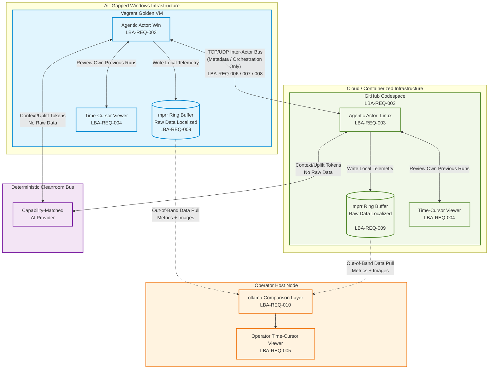
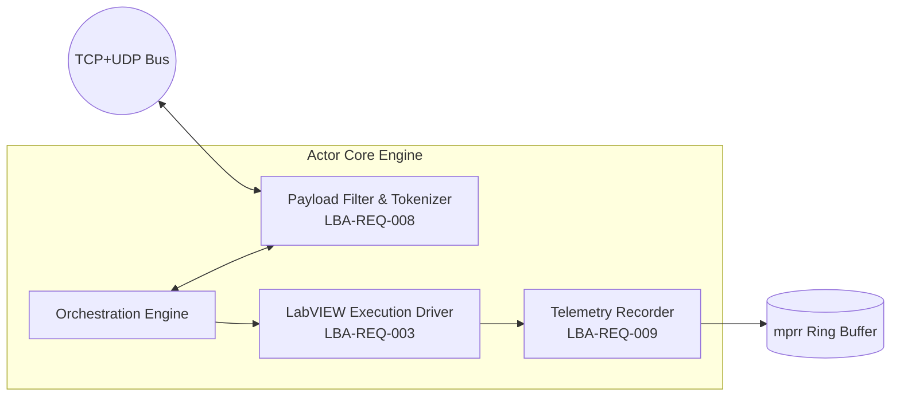
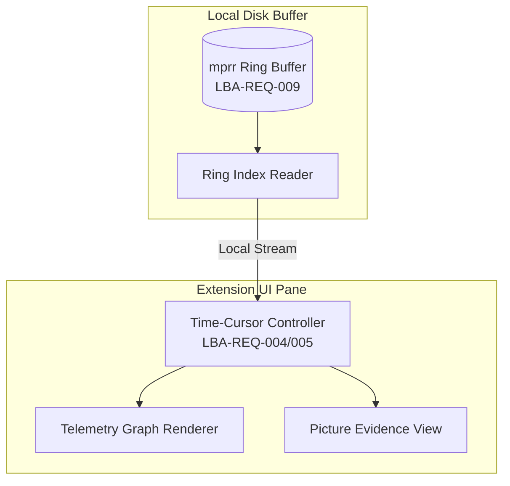
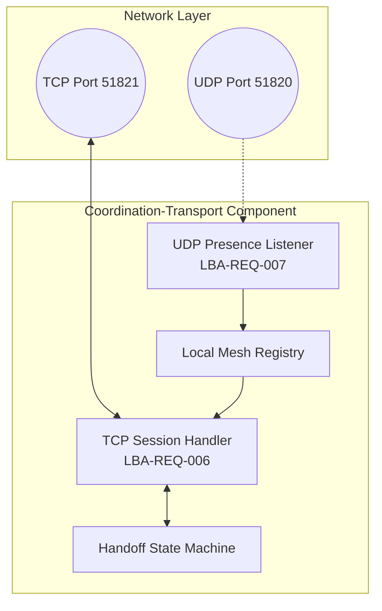
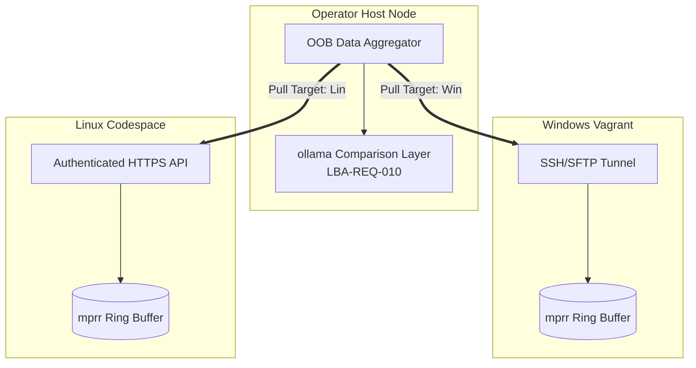
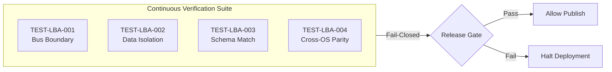

# labview-benchmark-actor — Architecture Description

Standards baseline: `repo-standards-review` v0.2.19. Architecture description follows ISO/IEC/IEEE 42010 (stakeholders, concerns, viewpoints, views, architecture decisions). It covers the original plan and the capabilities since delivered, each traced to its requirements in the RTM.

## 1. Stakeholders and concerns (42010 §5.3)

| Stakeholder | Concern |
| :--- | :--- |
| 🧑‍💻 Benchmark operator | Run benchmarks and review metric+picture evidence together over time |
| 🔧 Extension maintainer | Clean extraction boundary from `vi-history-suite`; reproducible builds |
| 🖥️ Golden-VM / infra owner | Reproducible multi-VM provisioning; safe, offline coordination |
| ⚖️ Standards reviewer | Requirements→architecture→test traceability, enforced as a fail-closed 42010 correspondence graph; stamped baseline |
| 🤖 Distributed-CI / cleanroom actor | Delegate uplift to a capability-matched AI provider over the bus; gate each outcome deterministically |
| 📦 Release manager | Bidirectional WIN↔LINUX sign-off before any shared-component publish; GitFlow governance on the release path |

## 2. Context view

`labview-benchmark-actor` is extracted from `vi-history-suite` (`LBA-REQ-001` [unmigrated]). To satisfy the Release Manager's cross-plane verification gates, the system architecture operates across a dual-OS framework (`LBA-REQ-002` [unmigrated]): local Windows environments execute via an air-gapped Vagrant golden VM to protect execution consistency, while Linux runtimes execute via a containerized GitHub Codespace.

The system triggers automated benchmarks via an agentic actor (`LBA-REQ-003` [unmigrated]), presents them in a time-cursor viewer (`LBA-REQ-004/005` [unmigrated]), and coordinates across multiple nodes over a private TCP/UDP mesh coordination bus (`LBA-REQ-006/007` [unmigrated]) instead of shifting state to GitHub Discussions.

To maintain strict network isolation and runtime deterministic bounds:

* 🎛️ **The Bus Payload Bounds**: The TCP/UDP bus is strictly restricted to inter-actor orchestration payloads and lightweight context metadata tokens (`LBA-REQ-008` [unmigrated]).
* 💾 **Data Localization**: Heavy execution assets (raw benchmarks, logs, and picture evidence) remain local within each VM's high-frequency `mprr` ring buffer (`LBA-REQ-009` [unmigrated]). Agents review only their own previous runs locally to prevent data leaks over the coordination bus.
* 🧠 **Out-of-Band Evaluation**: The benchmark operator aggregates cross-plane run data on-demand by pulling telemetry via an isolated, authenticated out-of-band collection channel to the operator host. This feeds concentrated metrics to a local `ollama` instance for multivariable multi-run analysis (`LBA-REQ-010` [unmigrated]).

The context diagram below places the actor in its multi-OS operational environment:



## 3. Viewpoints and views (42010 §5.5–5.6)

The subsections below realize the standard architecture views (the C4 / 42010 convention) divided strictly into the currently active Governed Baseline Section and the downstream Forecasted Pipeline Section.

## Phase 1: Governed Baseline Section

### 3.1 Packaging / boundary view — addresses LBA-REQ-017, LBA-REQ-020, LBA-REQ-021, LBA-REQ-022, LBA-REQ-085 [ADR-0066]

* **Dependency Isolation**: Every LabVIEW authoring-lane dependency must be recorded as a version-pinned entry in a governed dependency manifest (`experiments/labview-authoring/dep-manifest.json`) resolving to an absolute git SHA, pip version, or vipc configuration to guarantee reproducible Windows cleanroom environments (`LBA-REQ-017`).
* **Tooling Accessibility**: The system exposes the benchmark actor's tool surface directly to coding agents via a JSON-RPC 2.0 Model Context Protocol (MCP) server over newline-delimited stdio, supporting exactly four core tool handlers while degrading safely to soft `isError` signals on missing bus primitives (`LBA-REQ-019`).
* **Bidirectional Release Gate**: Component releases are blocked from publishing until both the WIN and LINUX planes record a matched `agreed:true` sign-off statement for that exact `<component, version>` block inside `tools/collab-cli/release-agreement.json` (`LBA-REQ-020`).
* **Strict Compliance Rules**: The system explicitly rejects any governed test file that cannot be traced to an active requirement token inside the RTM. Manual alteration to requirement tokens or views that breaks the parsing logic of `scripts/requirements_quality_check.py` triggers an immediate build-block failure (`LBA-REQ-021`).
* **Matrix Synthesis**: The requirement traceability matrix is auto-generated directly from the canonical SRS, RTM, and ADR records via `generate-traceability.mjs`. It reads the requirement IDs and titles from `docs/requirements/srs.md` and exits 1 fail-closed on any unmapped or missing links (`LBA-REQ-022`).
* **VSIX Byte-Reproducibility**: To bridge local verification with distributed deployment, the packaged `.vsix` is rendered byte-reproducible by stripping variable wall-clock data and pinning every zip entry modification timestamp to the DOS-zip epoch (`1980-01-01`) via `scripts/normalize-vsix.mjs` (`LBA-REQ-085` / `ADR-0066`).

---

## Phase 2: Forecasted Pipeline Section

### 3.2 Forecasted Deployment view — addresses LBA-REQ-002 [unmigrated], LBA-REQ-031 [ADR-0022], LBA-REQ-033 [ADR-0023]

* **Personal Golden-VM Onboarding**: Automated, from-scratch local provisioning of the environment is executed via `lba init`, adding the pinned NI apt repositories and installing `ni-labview-2026-community` + `vipm` non-interactively on an Ubuntu 24.04 (Noble) machine (`LBA-REQ-033` / `ADR-0023`).
* **Functional Verification**: Interactive license activation is validated by running a known-answer headless probe VI (`AddTwoNumbers.vi`) via `LabVIEWCLI -Headless`, minting a local `activation-receipt@1` and updating `mesh-actors.csv` only upon success (`ADR-0023`).

* Verify-Before-Install Check: Reviewer workstations block extension installations until a standalone validation CLI verifies that a minimum quorum of witnesses (quorumMin) have recorded signed attestations tracked inside an append-only, tamper-evident Merkle transparency log (LBA-REQ-031 / ADR-0022).

Here are the structural formatting fixes for the remaining sections (Sections 3.3 through 6), fully cleaned up with carriage returns, code block wrappers, and inline code formatting so they render perfectly on GitHub.

### 3.3 Forecasted Actor Component View — addresses LBA-REQ-003 [unmigrated], LBA-REQ-008 [unmigrated], LBA-REQ-009 [unmigrated]

The internal components of the `labview-benchmark-actor` core govern localized execution, state recording, and bounded bus communication. 

* 🧠 **Orchestration Engine**: Coordinates agent state, accepts task-context tokens from the bus, and drives local automation loops.
* 🛡️ **Payload Filter & Tokenizer (`LBA-REQ-008` [unmigrated])**: Inspects incoming/outgoing payloads. It enforces a strict frame budget of **4,096 bytes** and sniffs for raw binary headers (`PNG`, `JPEG`) to discard oversized visual logs before they touch the wire.
* ⚙️ **LabVIEW Execution Driver (`LBA-REQ-003` [unmigrated])**: Wraps `LabVIEWCLI` interfaces to execute native or cross-compiled benchmark VIs under headless constraints.
* 💾 **Telemetry Recorder (`LBA-REQ-009` [unmigrated])**: Streams high-frequency metric packets and visual evidence directly to the local `mprr` ring buffer under `experiments/mprr-ring/`, bypassing the network stack entirely.

### 3.4 Forecasted Viewer Component View — addresses LBA-REQ-004/005 [unmigrated], LBA-REQ-009 [unmigrated]

The Viewer Component View defines how local benchmarking runs are rendered, scrolled, and analyzed without violating the isolation of the `mprr` ring buffer.


* ⏱️ **Time-Cursor Controller (`LBA-REQ-004/005` [unmigrated])**: Maps an interactive timeline scrub bar to historical benchmarks, shifting a universal timestamp cursor that updates metric graphs and picture panels simultaneously.* 📊 **Telemetry Graph Renderer**: Displays hardware footprint data matching the exact location of the time cursor.* 🖼️ **Picture Evidence View**: Displays step-by-step visual UI captures of the LabVIEW front panels during the benchmark run.
* 🔍 **Ring Index Reader**: Provides low-latency, read-only sequential file access directly to the localized `mprr` storage layer, optimizing performance for rapid timeline scanning.

### 3.5 Forecasted Coordination-Transport Component View — addresses LBA-REQ-006/007/008 [unmigrated]

The Coordination-Transport component layer manages the multi-VM network fabric, facilitating secure discovery and low-overhead handshakes across heterogeneous operating systems without using cloud orchestration layers.


* **UDP Presence Listener (`LBA-REQ-007` [unmigrated])**: Listens for dynamic peer discoveries via cryptographic beacon packets broadcast over **UDP Port 51820** on internal virtual networks.
* **TCP Session Handler (`LBA-REQ-006` [unmigrated])**: Manages point-to-point connection states over **TCP Port 51821** for execution claims, handshakes, and minimal state coordination tokens. It terminates the connection immediately if any frame budget exceeds **4,096 bytes** (`LBA-REQ-008` [unmigrated]).

### 3.6 Forecasted Out-of-Band Host Aggregation Protocol (OOB-HAP) — addresses LBA-REQ-010 [unmigrated]

The Out-of-Band Host Aggregation Protocol defines the secure, pull-based extraction mechanism that the host uses to collect raw metrics and images from target nodes without routing data-heavy payloads over the coordination bus.


* **Windows Target Processing**: The host initiates an encrypted SSH/SFTP channel over the local host-only adapter network to pull binary segments from the localized `mprr` directory structure.* **Linux Target Processing**: The host leverages the authenticated Codespace port-forwarding layer, querying an internal, ephemeral HTTPS microservice bound to the Codespace interface to pipe raw run history.

### 3.7 Forecasted Ollama Analysis Data Model — addresses LBA-REQ-010 [unmigrated]

The host-side `ollama` comparison layer ingests raw benchmarks via a structured cross-platform JSON data model to normalize deviations between Windows and Linux environments.
```json
{
  "$schema": "https://json-schema.org",
  "title": "LBA_Ollama_Comparison_Payload",
  "type": "object",
  "required": ["comparison_id", "timestamp", "runs"],
  "properties": {
    "comparison_id": { "type": "string", "format": "uuid" },
    "timestamp": { "type": "string", "format": "date-time" },
    "runs": {
      "type": "array",
      "minItems": 2,
      "maxItems": 2,
      "items": {
        "type": "object",
        "required": ["node_id", "os_plane", "metrics", "visual_evidence_manifest"],
        "properties": {
          "node_id": { "type": "string", "pattern": "^(vagrant-golden-win-|codespace-linux-)[a-f0-9]{8}$" },
          "os_plane": { "type": "string", "enum": ["WINDOWS", "LINUX"] },
          "metrics": {
            "type": "object",
            "required": ["execution_duration_ms", "cpu_peak_percent", "memory_peak_mb"],
            "properties": {
              "execution_duration_ms": { "type": "integer" },
              "cpu_peak_percent": { "type": "number" },
              "memory_peak_mb": { "type": "number" }
            }
          },
          "visual_evidence_manifest": {
            "type": "array",
            "items": {
              "type": "object",
              "required": ["timestamp_cursor", "local_frame_hash", "base64_thumbnail_128x128"],
              "properties": {
                "timestamp_cursor": { "type": "string", "format": "date-time" },
                "local_frame_hash": { "type": "string", "pattern": "^[a-f0-9]{64}$" },
                "base64_thumbnail_128x128": { "type": "string" }
              }
            }
          }
        }
      }
    }
  }
}
```
### 3.8 Forecasted Configuration-Management & Assurance View — addresses LBA-REQ-018, LBA-REQ-020
* **Pipeline Governance**: Development is governed under strict GitFlow constraints. Feature branches must build against local verification configurations before merging into `develop`.
* **Release Verification**: Automated deployment operations execute `scripts/validate-release.sh` over target paths (`release/*`, `hotfix/*`), verifying that binary signatures are completely synchronized before finalizing the release agreement matrix (`LBA-REQ-020`).

### 3.9 Forecasted Corroboration-Grid View — addresses LBA-REQ-031 [ADR-0022]
* **Cryptographic Trust Anchor**: Multi-witness verification and receipt tracking are driven exclusively by **Ed25519** public-key signatures, maintaining an append-only transaction state.
* **Tree Verification**: Root verification strings are calculated via RFC 6962 Certificate Transparency constraints using domain-separated leaf combinations (`SHA-256(0x00 || data)`) to assert inclusion proofs before any workstation installation path is cleared (`LBA-REQ-031` / `ADR-0022`).
#### Phase 2 General Forecast Catch-All ClauseAny future requirements from `LBA-REQ-023` through `LBA-REQ-100` discovered during implementation must be appended to the register using the single-`shall` format and validated through `scripts/requirements_quality_check.py` before they can be linked to code changes.
---

## 4. Architecture Decisions (42010 §5.7)

### Phase 1: Governed Decisions

| Decision ID | Target Requirement | Rationale / Strategy |
| :--- | :--- | :--- |
| **ADR-0066** | `LBA-REQ-085` | Normalize `.vsix` modification timestamps to the 1980 DOS epoch via `scripts/normalize-vsix.mjs` to ensure reviewed hash equals shipped hash. |
| **ADR-0022** | `LBA-REQ-031` | Enforce RFC 6962 compliant Ed25519 Merkle transparency logs to execute verify-before-install checks on the workstation. |
| **AD-14** | `LBA-REQ-017` | Lock dependency versions to hard, explicit references inside `dep-manifest.json` to guarantee reproducible cleanrooms. |
| **AD-15** | `LBA-REQ-019` | Expose execution states, bus logs, and series lookups to coding agents via newline-delimited JSON-RPC 2.0 MCP tools. |
| **AD-16** | `LBA-REQ-020` | Require bidirectional `agreed:true` sign-offs from both target planes within `release-agreement.json` before triggering a publish job. |

### Phase 2: Forecasted Decisions

| Decision ID | Target Requirement | Rationale / Strategy |
| :--- | :--- | :--- |
| **ADR-0023** | `LBA-REQ-033` | Automate from-scratch provisioning of local Ubuntu environments via `lba init` using native NI apt structures. |
| **AD-17** | `LBA-REQ-002` | Partition the target plane strategy between local air-gapped Vagrant boxes (Windows) and cloud containers (Linux Codespaces). |
| **AD-18** | `LBA-REQ-008` | Enforce strict 4,096-byte frame budget sizing limits and header packet sniffing on the coordination bus. |
| **AD-19** | `LBA-REQ-009` | Isolate raw imagery and telemetry logs to local disk directories using the absorbed `mprr` ring-buffer design block. |
| **AD-21** | `LBA-REQ-010` | Use an out-of-band pull mechanism to feed cross-platform JSON data to the host's local Ollama comparison layer. |

---

## 5. System Test Assertions for Verification

To satisfy the standards reviewer’s requirement for a fail-closed 42010 correspondence graph, the architecture is evaluated continuously via four deterministic system assertions within the CI pipeline.



* **`TEST-LBA-001` (Coordination Bus Payload Boundaries)**:  
  **[CONDITIONAL CI GATE: Active only upon migration of matching Phase 2 requirements into the governed register]**  
  Asserts that zero raw binary log strings or image payloads traverse the network bus (`LBA-REQ-008`). The pipeline mirrors and scans all network frames, throwing an immediate `ERR_BUS_PAYLOAD_EXCEEDED` error if a frame exceeds **4,096 bytes** or matches binary file headers (`PNG`, `JPEG`).

* **`TEST-LBA-002` (High-Frequency Local Storage Isolation)**:  
  **[CONDITIONAL CI GATE: Active only upon migration of matching Phase 2 requirements into the governed register]**  
  Verifies that high-frequency data structures stay isolated on-disk within the execution host (`LBA-REQ-009`). The system tests execution with all network adapters disabled and confirms the actor appends new visual tracking records directly into the local `mprr` ring directory.

* **`TEST-LBA-003` (Out-of-Band Schema Conformance)**:  
  **[CONDITIONAL CI GATE: Active only upon migration of matching Phase 2 requirements into the governed register]**  
  Evaluates whether out-of-band aggregated data profiles fit the explicit structural `LBA_Ollama_Comparison_Payload` schema layout (`LBA-REQ-010`). The runner processes concentrated logs via strict JSON validators, asserting configuration details match specification parameters perfectly.

* **`TEST-LBA-004` (Cross-Plane Execution Determinism)**:  
  **[CONDITIONAL CI GATE: Active only upon migration of matching Phase 2 requirements into the governed register]**  
  Asserts that configuration analysis outputs generated across Windows nodes match corresponding Linux runs identically (`LBA-REQ-043`). The pipeline evaluates filtered log files via strict character-by-character hashing, throwing an `ERR_CROSS_PLANE_DIVERGENT_VERDICT` on any character mismatch.

---

## 6. Risks and Open Questions

* **[Open Axis] Capture Cadence Bounds**: Managing performance metrics versus target panel image processing speeds across distinct operating systems.
* **[Managed Risk] Scope Extension Control**: Enforcing explicit, bounded module definition files prevents development dependencies from drifting from system guidelines.


* [Open Axis] Capture Cadence Bounds: Managing performance metrics versus target panel image processing speeds across distinct operating systems.
* [Managed Risk] Scope Extension Control: Enforcing explicit, bounded module definition files prevents development dependencies from drifting from system guidelines.


