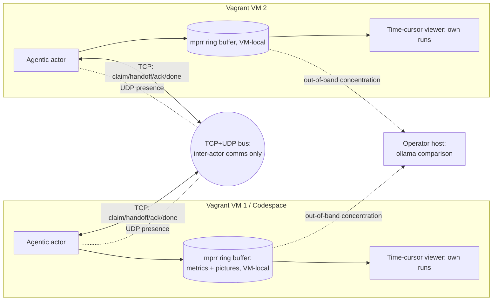

# labview-benchmark-actor — Architecture Description

> Standards baseline: `repo-standards-review` v0.2.19. Architecture description
> follows ISO/IEC/IEEE 42010 (stakeholders, concerns, viewpoints, views,
> architecture decisions). It covers the original plan and the capabilities
> since delivered, each traced to its requirements in the RTM.

## 1. Stakeholders and concerns (42010 §5.3)

| Stakeholder | Concern |
| --- | --- |
| Benchmark operator | Run benchmarks and review metric+picture evidence together over time |
| Extension maintainer | Clean extraction boundary from `vi-history-suite`; reproducible builds |
| Golden-VM / infra owner | Reproducible multi-VM provisioning; safe, offline coordination |
| Standards reviewer | Requirements→architecture→test traceability, enforced as a fail-closed 42010 correspondence graph; stamped baseline |
| Distributed-CI / cleanroom actor | Delegate uplift to a capability-matched AI provider over the bus; gate each outcome deterministically |
| Release manager | Bidirectional WIN↔LINUX sign-off before any shared-component publish; GitFlow governance on the release path |

## 2. Context view

`labview-benchmark-actor` is extracted from `vi-history-suite` (LBA-REQ-001) and
installed on a Codespace or Vagrant golden VM (LBA-REQ-002). It runs benchmarks
via its agentic actor (LBA-REQ-003), presents them in a time-cursor viewer
(LBA-REQ-004/005), and coordinates across multiple VMs over a TCP/UDP bus
(LBA-REQ-006/007) instead of a GitHub Discussion. The bus carries **inter-actor
communication only**; run data (metrics + pictures) stays VM-local in **mprr**'s
ring buffer (LBA-REQ-009). Agents review only their **own** previous runs; the
operator concentrates runs to the host for an **ollama** comparison layer
(LBA-REQ-010).

The **context diagram** below places the actor in its operational environment
(the Vagrant VMs / Codespace, the coordination bus, and the operator host):

## 3. Viewpoints and views (42010 §5.5–5.6)

The subsections below realize the four standard architecture views (the C4 /
42010 convention): the **context view** is the §2 context diagram (the system
in its environment); the **container view** is §3.1 (packaging) plus §3.2
(deployment) — the deployable `.vsix`, the VM-local mprr ring-buffer store, and
the coordination bus as the runtime containers; the **component view** is
§3.3–§3.5 — the actor / run-result, viewer, and coordination-transport
components inside those containers; and the **deployment view** is §3.2 — the
multi-VM / Codespace topology.

### 3.1 Packaging / boundary view — addresses LBA-REQ-001, LBA-REQ-008, LBA-REQ-085, LBA-REQ-086, LBA-REQ-093
- The extension is a self-contained `.vsix`. Reused `vi-history-suite` logic is
  vendored or a pinned published dependency — never a relative path.
- A moved-module manifest records the extraction so the origin can be retired.
- The packaged `.vsix` is byte-reproducible (ADR-0066): a post-package normalizer
  pins every zip entry timestamp to 1980-01-01 so repackaging the same committed
  source yields a byte-identical artifact, so the reviewed `vsixSha256` can equal
  the shipped one.
- It is byte-reproducible ACROSS planes too (ADR-0067): the normalizer also pins
  entry mode + version-made-by, and `.gitattributes` + `tsconfig` `newLine: lf`
  force LF content, so a Windows build and a Linux build of the same commit are
  byte-identical — proven by a dual-OS (ubuntu+windows) CI build+compare.
- The Node.js version that packages the `.vsix` is pinned exactly (issue #408): a
  repo-root `.nvmrc` (`24.19.0`) is sourced by every release-path workflow via
  `node-version-file: .nvmrc`, because the packaged bytes are reproducible only
  within an exact Node version (a Node minor can perturb them), so the reviewed
  (local) build and the CI publish build resolve the same Node and cannot drift —
  gated by `release-path-node-pinned` (LBA-REQ-093).

### 3.2 Deployment view — addresses LBA-REQ-002, LBA-REQ-006, LBA-REQ-033, LBA-REQ-038, LBA-REQ-039, LBA-REQ-040, LBA-REQ-041, LBA-REQ-042, LBA-REQ-043, LBA-REQ-044, LBA-REQ-045, LBA-REQ-046, LBA-REQ-047, LBA-REQ-048, LBA-REQ-049, LBA-REQ-050, LBA-REQ-051, LBA-REQ-052, LBA-REQ-053, LBA-REQ-054, LBA-REQ-055, LBA-REQ-056, LBA-REQ-057, LBA-REQ-058, LBA-REQ-059, LBA-REQ-060, LBA-REQ-061, LBA-REQ-062, LBA-REQ-063, LBA-REQ-064, LBA-REQ-065, LBA-REQ-066, LBA-REQ-067, LBA-REQ-068, LBA-REQ-069, LBA-REQ-070, LBA-REQ-071, LBA-REQ-072, LBA-REQ-073, LBA-REQ-074, LBA-REQ-075, LBA-REQ-076, LBA-REQ-077, LBA-REQ-078, LBA-REQ-079, LBA-REQ-080, LBA-REQ-081, LBA-REQ-082, LBA-REQ-083, LBA-REQ-084, LBA-REQ-091, LBA-REQ-092
- One artifact, two install targets (Codespace, Vagrant golden VM).
- A declarative topology spawns N VMs, each activating the extension with a
  unique participant identity; teardown is clean.
- **Personal golden-VM onboarding (LBA-REQ-033):** a one-command `lba init`
  provisions a from-scratch Ubuntu 24.04 (Noble) VM, installs LabVIEW 2026
  Community Edition + VIPM from the NI apt repo, has the member activate
  interactively, then **confirms activation with a headless probe VI**
  (`LabVIEWCLI`) and mints a **local** personal golden VM registered as a mesh
  actor (ADR-0023). `LabVIEWCLI -Headless` is the actor runtime.
- **Activation confirmation, delivered (LBA-REQ-038):** the confirmation step is
  realized first — a headless **known-answer probe** (`LabVIEWCLI RunVI` on the
  shipped `AddTwoNumbers.vi`) must return the expected sum for the install to
  count as activated. The result is a deterministic `activation-receipt@1` whose
  digest covers only the verdict-bearing fields, so a committed **real** capture
  (LabVIEW 2026, 20 + 22 = 42) replays offline in CI and fails closed on any
  un-activated signal.
- **Mesh-actor registration, gated (LBA-REQ-039):** the golden VM is enrolled in
  `mesh-actors.csv` only after its activation receipt confirms activation — an
  unactivated or tampered receipt is refused and the registry is left untouched,
  so confirmation and enrollment are one fail-closed chain (ADR-0023).
- **Distributed workload, delivered (LBA-REQ-040):** the executor spreads an
  independent-task workload across a budget-capped, dynamically-discovered pool
  (this host + codespaces + local VMs) proportional to each instance's capacity,
  running disjoint shards concurrently — every instance searching with ripgrep
  only. Proven live across three instances; a fail-closed gate replays the receipt
  (ADR-0028), a step toward the North Star distributed benchmark mesh.
- **Capability-aware routing (LBA-REQ-041):** each distributed task runs only on
  an instance advertising the capability it needs — a real `LabVIEWCLI RunVI` task
  is routed to the LabVIEW-capable host while node tasks spread across the pool. A
  fail-closed gate proves capability-correct placement (ADR-0029); the substrate
  for cross-plane distribution once a second LabVIEW instance joins.
- **Cross-plane LabVIEW liveness (LBA-REQ-042):** the fleet has two independent,
  activated LabVIEW planes — this host and the Ubuntu golden VM — each proven live
  by running the known-answer activation probe concurrently. A fail-closed gate
  requires >= 2 activated planes (ADR-0030); the substrate for cross-plane
  benchmark comparison, and Phase 1 (ADR-0023) proven operational.
- **Cross-plane comparison, proven (LBA-REQ-043):** the same VI Analyzer config run
  on both LabVIEW planes (host + golden VM) yields a byte-identical deterministic
  resultHash — objective, reproducible cross-plane benchmark equivalence, the North
  Star. A fail-closed gate requires the planes agree (ADR-0031, builds on
  LBA-REQ-015).
- **Provisioner installs LabVIEW + VIPM (LBA-REQ-044):** the from-scratch Ubuntu
  golden-VM provisioner installs LabVIEW 2026 Community (NI apt repo, committed key)
  and VIPM (the JKI .deb), so the golden VM is complete. A fail-closed gate keeps
  both installs present (ADR-0023); proven live — VIPM 26.3.1 installed on the
  scratch VM from JKI.
- **Human-assisted VM bridge (LBA-REQ-045):** a shared tmux session on the golden VM
  lets an automation agent drive the VM's interactive shell (`send-keys`/`capture-pane`
  over ssh) while a human attaches to type any password or token directly on the VM —
  credentials never transit the agent or the model. A fail-closed gate proves the
  bridge is secret-safe (ADR-0032); proven live — the agent detected a real
  `password:` prompt (exit 42) and handed off without answering.

### 3.3 Actor / run-result view — addresses LBA-REQ-003, LBA-REQ-009
- The agentic actor drives a run and emits a **schema-versioned run result**:
  an ordered metric time-series and an ordered set of captured pictures, all on
  one run clock. This schema is the contract between actor and viewer.
- Captured pictures are stored **VM-locally** in mprr's ring buffer
  (long-packet), indexed via short-packet; the run result carries frame `ref`s
  into that local store, never image bytes (ADR-0005, LBA-REQ-009).

### 3.4 Viewer view — addresses LBA-REQ-004, LBA-REQ-005
- A single **selected-time** value is the source of truth. The draggable
  vertical cursor writes it; the chart and the picture panel below read it.
- Pictures are indexed by run-relative timestamp for O(log n) nearest-at-or-
  before resolution; the panel shows the indexed frame or an explicit
  "no frame" state.
- The viewer operates over the actor's **own** previous runs (local mprr
  store); there is no cross-VM comparison (LBA-REQ-010, ADR-0006).

### 3.5 Coordination-transport view — addresses LBA-REQ-007
- **TCP** carries reliable, ordered coordination (claim / handoff / ack / done /
  progress / note) preserving the GitHub-Discussion collab semantics
  (check-before-publish, one owner per hotspot).
- **UDP** carries presence/liveness (and a coordination time reference); it is
  **not** used for run comparison, since runs are never compared across VMs
  (ADR-0006).
- Messages are schema-versioned with sender id, timestamp, and session id; a
  late joiner reconstructs session state from the TCP log.
- The bus carries **inter-actor communication only** (claim/handoff/ack/done/
  note); it never carries run data, run/frame metadata, or images — the entire
  mprr ring buffer stays VM-local (ADR-0005, LBA-REQ-009).

### 3.6 Analysis view — addresses LBA-REQ-010, LBA-REQ-011, LBA-REQ-014, LBA-REQ-015, LBA-REQ-032
- Resource-usage correlation folds CPU/RAM/disk samples onto the benchmark frame
  timeline on a shared epoch-ms axis and, anchored on a trigger instant, computes
  a pre/post-trigger window (count, mean, min, max, delta) per metric — so a
  run's machine cost is readable against its own frames (LBA-REQ-011).
- Mesh-stress performance-signature calibration extracts a per-actor signature
  (the repetitive + outlier features of the 42-counter series across repeated
  runs), fits a stress-ladder calibration curve (rung → expected value + tolerance
  band, scored monotone/separable/repeatable), and inverse-reads an observed
  signature to an inferred stress level (LBA-REQ-032).
- Cross-plane comparison ingests the same mprr short-packet input on each plane
  (LINUX, WIN), stores a plane-local run, and compares a shared `benchmarkId`:
  the deterministic `seriesHash` MUST match across planes (substrate-independent
  correctness); the per-plane screenshot hash is a visual witness (LBA-REQ-014).
- A VI Analyzer run over the repo VIs is summarized into a deterministic,
  order-independent result (pass/fail/error counts + per-VI findings + a
  `resultHash`), making a static-analysis run a cross-plane-comparable benchmark
  (LBA-REQ-015).

### 3.7 Agentic-infrastructure view — addresses LBA-REQ-012, LBA-REQ-013, LBA-REQ-018, LBA-REQ-019
- The `lbabus` binary embeds version-pinned agent base instructions and exposes
  them via `lbabus agents` (print / --out / --check), so every session on a given
  version shares byte-identical, hardenable base instructions (LBA-REQ-012).
- The bus carries a priority tier (P0>P1>P2>P3) and an explicit addressee as
  additive flat-scalar fields that keep the `vihs-collab-msg@v1` schema, with
  `--to-me` / `--min-priority` reader filters, so triage never breaks older
  clients (LBA-REQ-013).
- Uplift / documentation tasks are delegated to a capability-matched cleanroom AI
  provider over the bus; the provider seam is agnostic (ollama / copilot-cli /
  codex / mock), outcomes are gated deterministically, and a receipt is announced
  as an ADR-0003 `DONE` frame (LBA-REQ-018, ADR-0011).
- The actor exposes its tools (host capabilities, benchmark series, bus
  poll / post) to a coding agent through a Model Context Protocol server
  (LBA-REQ-019, ADR-0012).

### 3.8 Configuration-management & assurance view — addresses LBA-REQ-016, LBA-REQ-017, LBA-REQ-020, LBA-REQ-021, LBA-REQ-022, LBA-REQ-030, LBA-REQ-034, LBA-REQ-035, LBA-REQ-036, LBA-REQ-037
- GitFlow branch governance (`main` protected + `develop` integration;
  feature / release / hotfix; SemVer tags on main; coverage retained on the
  release path) satisfies the repo-standards-review CM gate without weakening the
  CI-owned protected-main publish authority (LBA-REQ-016, ADR-0010).
- Every LabVIEW authoring-lane dependency is a version-pinned entry in a governed
  dependency manifest, so the authoring build is reproducible (LBA-REQ-017).
- A shared-component release is blocked until both the WIN and LINUX planes record
  an agreed sign-off for that exact version (LBA-REQ-020).
- Traceability is enforced as a 42010 correspondence graph: every governed test
  corresponds to ≥1 requirement (fail-closed), with the ADR↔requirement and
  requirement↔view rules promoted to fail-closed as the registers reconcile
  (LBA-REQ-021, ADR-0013).
- The bounded ISO/IEC/IEEE 26514 information-for-users product set is kept complete
  and command-covering by a fail-closed gate — a required item missing or a
  contributed command left undocumented blocks the build — under an explicit
  conformance boundary (LBA-REQ-034, ADR-0024).
- The requirement traceability matrix (`docs/requirements/traceability-matrix.md`)
  is generated from the canonical sources rather than hand-maintained, so the
  requirement → view → decision → test view stays current by construction
  (LBA-REQ-022, ADR-0013).
- The executed **test report** (ISO/IEC/IEEE 29119-3) and the **configuration
  status accounting** record (ISO 10007 / ISO/IEC/IEEE 12207) are generated from
  the verification apparatus into `docs/testing/test-report.md`, so the recorded
  outcomes and controlled state cannot drift from the gates, correspondence rules,
  requirements, and decisions they describe (LBA-REQ-035, ADR-0025).
- The signed, corroborated **release procedure** (ISO/IEC/IEEE 15289 procedure;
  12207 / ISO 10007 release process) is a first-class information item
  (`docs/release/release-procedure.md`) whose cited workflows, scripts, and
  release invariants are kept resolvable by a fail-closed gate, so the procedure
  cannot rot away from the apparatus it directs (LBA-REQ-036, ADR-0026).
- The repository **self-audits** its five-lens standards posture (REQ/ARCH/TEST/
  CM/DOC) at clause-evidence granularity and generates a scorecard
  (`docs/compliance/compliance-posture.md`); a fail-closed gate asserts 25/25 at
  target, so full standards compliance is verified continuously and cannot
  silently regress (LBA-REQ-037, ADR-0027).

### 3.9 Corroboration-grid view — addresses LBA-REQ-023, LBA-REQ-024, LBA-REQ-025, LBA-REQ-026, LBA-REQ-027, LBA-REQ-028, LBA-REQ-029, LBA-REQ-031, LBA-REQ-087, LBA-REQ-088, LBA-REQ-089, LBA-REQ-090

The Actor Corroboration Grid (ADR-0014) corroborates a component release across
independent, heterogeneous witnesses. Each witness — initially a Codespace-Linux node,
the VirtualBox-Linux cleanroom, and the Windows plane — builds `lbabus` from the same
source@commit, self-certifies via the shared gate-suite, renders the deterministic
viewer, and emits a signed receipt bundle. A majority (≥2 of 3) must agree on the
OS-independent anchors (viewer `seriesHash`, `lbabus` version + `sourceCommit`,
gate-suite `verdict`) — the Linux subset additionally on the pinned `pngSha256` and the
Ubuntu codename — for the quorum to permit the release; a sub-majority blocks it and
opens a divergence issue (LBA-REQ-023, ADR-0014). The quorum arithmetic (a graded majority
over tiered anchors, LBA-REQ-024, ADR-0015), the signed provenance chain verified before
consumption (LBA-REQ-025, ADR-0016), and the enforced witness independence (distinct enrolled
environments, LBA-REQ-026, ADR-0017) refine this view. The reviewer station and human sign-off
(LBA-REQ-027, ADR-0018), the mesh verdict beacon (LBA-REQ-028, ADR-0019), and the agent-facing
MCP orchestration surface (LBA-REQ-029, ADR-0020) complete it. Provenance is published to a signed,
append-only Merkle transparency log (RFC 6962) and the reviewer station verifies a release's corroboration
chain is attested and logged before installing it (verify-before-install, LBA-REQ-031, ADR-0022).

## 4. Architecture decisions (42010 §5.7)

| AD | Decision | Rationale | Traces to |
| --- | --- | --- | --- |
| AD-1 | Extract as a standalone extension, not a fork | Clean boundary; independent release cadence | LBA-REQ-001 |
| AD-2 | One artifact, two install targets | Reproducible benchmarking baseline on Codespace and VM | LBA-REQ-002 |
| AD-3 | Single schema-versioned run-result contract | Decouples actor from viewer; enables reproducibility checks | LBA-REQ-003 |
| AD-4 | Single selected-time source of truth | Guarantees cursor↔picture synchronization | LBA-REQ-004/005 |
| AD-5 | TCP for order, UDP for presence/liveness (advisory time) | Reliability where needed, low latency where tolerable | LBA-REQ-007 |
| AD-6 | Loopback / private-network bind by default | Offline, air-gapped, no public exposure | LBA-REQ-007 |
| AD-7 | Mirror the collab-bus semantics on the new transport | Preserve a proven coordination model across a transport change | LBA-REQ-007 |
| AD-8 | Store all run data in the VM-local mprr ring buffer; bus carries inter-actor comms only | Reuse the absorbed mprr model's governed bounded-RAM ring buffer; keep the bus data-agnostic; cleanroom isolation | LBA-REQ-009 |
| AD-9 | No cross-VM comparison; concentrate runs to the host for an ollama layer | Preserve cleanroom isolation; improve comparison on one concentrated corpus | LBA-REQ-010 |
| AD-10 | Own the mprr ring/timing model in-repo (absorbed, dependency-free); retire the external `svelderrainruiz/mprr` dependency | Self-contained + testable in-repo; no outside schema to track; the `mprr` name is kept for the local model (ADR-0009) | LBA-REQ-003, LBA-REQ-005, LBA-REQ-009 |
| AD-11 | Correlate CPU/RAM/disk to the frame timeline with a trigger-anchored pre/post window | The resource cost of a benchmarked action is readable against its own run | LBA-REQ-011 |
| AD-12 | Embed version-pinned agent base instructions in the `lbabus` binary | Same version ⇒ byte-identical, hardenable base instructions across sessions | LBA-REQ-012 |
| AD-13 | Priority + addressee envelope on the bus, additive and back-read-compatible -- RETIRED (ADR-0048): a GitHub-Discussion transport feature (`post --priority`/`--to`, `poll --min-priority`/`--to-me`), removed with the transport (ADR-0047); the live-only net bus carries no priority/addressing (no async inbox to triage; `net send --hosts` targets a peer) | Triage without breaking the `vihs-collab-msg@v1` schema for older clients (historical; superseded) | LBA-REQ-013 |
| AD-14 | Deterministic cross-plane benchmark compare (the `seriesHash`/`resultHash` must match; the screenshot is a witness) | Substrate-independent correctness across LINUX/WIN | LBA-REQ-014, LBA-REQ-015 |
| AD-15 | GitFlow branch governance (`main` protected + `develop` integration) | Passes the repo-standards CM gate without weakening CI publish authority (ADR-0010) | LBA-REQ-016 |
| AD-16 | Version-pin every LabVIEW authoring-lane dependency in a governed manifest | Reproducible authoring-lane build on the clean room | LBA-REQ-017 |
| AD-17 | Delegate validated uplift to a capability-matched cleanroom AI provider over the bus | Providers run where the licence/capability lives; the host observes gated outcomes (ADR-0011) | LBA-REQ-018 |
| AD-18 | Expose the actor's tools to agents via a Model Context Protocol server | A standard, agent-discoverable tool surface (ADR-0012) | LBA-REQ-019 |
| AD-19 | Bidirectional WIN↔LINUX sign-off gates every shared-component publish | Neither plane ships an unreviewed shared release | LBA-REQ-020 |
| AD-20 | Enforce a 42010 correspondence graph as fail-closed CI gates | Traceability that cannot silently rot (ADR-0013) | LBA-REQ-021 |
| AD-21 | Generate the requirement traceability matrix from the canonical sources rather than hand-maintaining it | A single derived, gated view that cannot drift from the SRS / RTM / architecture / ADRs (ADR-0013) | LBA-REQ-022 |
| AD-22 | Corroborate each component release via a multi-witness quorum (the Actor Corroboration Grid) | Independent cross-environment agreement raises release confidence and resists forgery (ADR-0014) | LBA-REQ-023 |
| AD-23 | Score the corroboration quorum as a graded majority over tiered anchors | Heterogeneous witnesses compose; one outage tolerated; divergence is actionable (ADR-0015) | LBA-REQ-024 |
| AD-24 | Sign and verify the whole corroboration provenance chain before consumption | No unattested release is installable; tamper-evidence is external (ADR-0016) | LBA-REQ-025 |
| AD-25 | Require distinct enrolled environments for a valid quorum | Agreement cannot be forged by cloning one environment (ADR-0017) | LBA-REQ-026 |
| AD-26 | Human sign-off is a separate gate atop the machine quorum, on a dual reviewer station | A subjective judgment complements but does not replace the deterministic quorum (ADR-0018) | LBA-REQ-027 |
| AD-27 | Witnesses beacon their verdicts over the lbabus mesh | Live, distributed verdict collection reusing the bus, no new transport (ADR-0019) | LBA-REQ-028 |
| AD-28 | Extend the MCP tool surface with grid-orchestration tools | One discoverable agent surface drives the grid (ADR-0020, ADR-0012) | LBA-REQ-029 |
| AD-29 | Non-release pull requests target develop, not main | Prevents the stale main-based pull-request class from dumping integration onto the release branch (ADR-0021, ADR-0010) | LBA-REQ-030 |
| AD-30 | Publish corroboration provenance to a signed Merkle transparency log and verify inclusion before install | Append-only, offline-verifiable provenance; no unattested or un-logged release is installable (ADR-0022, ADR-0016) | LBA-REQ-031 |
| AD-31 | One-command `lba init` provisions an Ubuntu 24.04 golden VM with LabVIEW 2026 CE + VIPM; a headless probe VI confirms activation; the VM is minted locally and registered as a mesh actor | From-scratch, reproducible Linux onboarding unlocks the OS comparison axis without a shared box registry (ADR-0023) | LBA-REQ-033, LBA-REQ-038, LBA-REQ-039, LBA-REQ-044, LBA-REQ-046 |
| AD-32 | Govern the bounded ISO/IEC/IEEE 26514 information-for-users set with a fail-closed completeness + command-coverage gate | Non-gated documentation drifts from the product; enforcing the bounded product set keeps user information current by construction (ADR-0024) | LBA-REQ-034 |
| AD-33 | Generate the 29119-3 test report + ISO 10007 status accounting from the verification apparatus and gate it fail-closed on drift | The repo recorded a test plan but never the executed outcomes or controlled configuration state; generating them from the enforced apparatus keeps assurance current by construction (ADR-0025) | LBA-REQ-035 |
| AD-34 | Make the signed, corroborated release procedure a first-class 15289 information item and gate its cited enforcement points + invariants fail-closed | The release flow was scattered across the CM plan and the grid requirements with no single procedure; gating it keeps the procedure resolvable and invariant-complete by construction (ADR-0026) | LBA-REQ-036 |
| AD-35 | Self-audit the five-lens standards posture at clause-evidence granularity and gate 25/25 fail-closed | The 25/25 audit was a point-in-time score; a generated, fail-closed self-audit makes full compliance corroborated by construction and closes F4 (non-gated conformance) for all standards (ADR-0027) | LBA-REQ-037 |
| AD-36 | Distribute the workload across an N-instance ripgrep-only pool (host + codespaces + VMs), dynamically discovered, capacity-weighted, and budget-capped | Spreading load off the host toward the North Star distributed mesh; a fail-closed gate replays a real 3-instance receipt (ADR-0028) | LBA-REQ-040 |
| AD-37 | Route each distributed task only to an instance advertising the capability it requires (LabVIEW to LabVIEW-capable instances, node work anywhere) | LabVIEW lives only on capable instances; capability routing makes the heterogeneous fleet do real cross-plane work correctly (ADR-0029) | LBA-REQ-041 |
| AD-38 | Prove cross-plane LabVIEW liveness by running the known-answer probe on every LabVIEW plane (host + LabVIEW VMs), requiring >= 2 activated planes | Real cross-plane comparison needs more than one activated LabVIEW plane; the golden VM (ADR-0023) becomes a proven second plane (ADR-0030) | LBA-REQ-042 |
| AD-39 | Verify cross-plane benchmark determinism by matching the same VI Analyzer config's resultHash across LabVIEW planes | Turns liveness into objective, reproducible comparison (the North Star); a divergent resultHash fails the gate (ADR-0031, LBA-REQ-015) | LBA-REQ-043 |
| AD-40 | Provide a human-assisted shared-tmux bridge to the golden VM — the agent drives the interactive shell while the human types secrets directly on the VM | Agent-driven onboarding needs credentials (LabVIEW/VIPM activation, sudo) that must never transit the agent; a secret-safe bridge keeps the human in the loop for secrets only (ADR-0032) | LBA-REQ-045 |
| AD-41 | Stream the golden VM live status (CPU busy%, LabVIEW/vipm/Xvfb) over the bridge and analyze captured timelines for idle spans, so no long stretch of "dead time" is invisible to human or agent | Human-assisted onboarding has long silent waits (LabVIEW idle while VIPM connects); live visibility plus a deterministic idle-time analysis surface and quantify the dead time to drive it out (ADR-0023) | LBA-REQ-047 |
| AD-42 | Benchmark the golden VM by mass-compiling a pinned public LabVIEW source (ni/labview-icon-editor) with LabVIEWCLI, recording a timing-invariant result identity plus the compile time | A MassCompile of a pinned public source is a real, reproducible LabVIEW workload; a machine-independent result hash makes it cross-plane comparable (the North Star) while the compile time is the performance metric (ADR-0023) | LBA-REQ-048 |
| AD-43 | Gate the golden-VM provisioner's headless-LabVIEW readiness by statically verifying (against the actual script text) that it installs Xvfb + dual-basename VI Server config + quoted access + reboot | A fresh provision was not headless-ready without three manual fixes; binding a fail-closed receipt to the provisioner text keeps the one-command First Win from silently regressing (ADR-0023) | LBA-REQ-049 |
| AD-44 | Unify the per-benchmark cross-plane receipts into one generated benchmark grid (identity per plane + performance), gated fail-closed on any determinism violation | The North Star is a reproducible cross-plane comparison; a single generated grid is the artifact that comparison is for, and a fail-closed gate makes an identity divergence impossible to merge (ADR-0031, roadmap Phase 4) | LBA-REQ-050 |
| AD-45 | Cover the First Win umbrella (LBA-REQ-033) by composing its Proven slices into one `lba init` flow, gated by `first-win-onboarding` on step-realization resolution + a confirmed live activation | The one-command golden-VM onboarding is realized by the provision + headless-readiness + activation-receipt + mesh-registration slices; composing them into a single gated flow proves the end-to-end First Win without re-implementing it (ADR-0023 Phase 1) | LBA-REQ-033 |
| AD-46 | Reproduce the icon-editor's real CI as a 2-actor benchmark grid in the NI LabVIEW container -- the builder actor builds the Editor Packed Library with native LabVIEWCLI ExecuteBuildSpec (no g-cli) | A well-known community project's own CI (build PPL + LUnit test) becomes a governed, cross-plane-comparable benchmark; LabVIEW runs licensed + headless in the NI container, so ExecuteBuildSpec builds the PPL directly (ADR-0033, roadmap Phase 2) | LBA-REQ-051 |
| AD-47 | Build the Linux g-cli launcher from its Rust source (rust-proxy crate) and prove it end-to-end on host LabVIEW -- the enabler for the grid's LUnit tester actor | g-cli has no prebuilt Linux binary; building the rust-proxy with cargo and driving a real LabVIEW round-trip (launch VI -> echo args over TCP -> exit 0) proves g-cli works on this plane before wiring `g-cli ... lunit` (ADR-0033, roadmap Phase 2) | LBA-REQ-052 |
| AD-48 | Complete the 2-actor icon-editor grid with the LUnit tester -- run `g-cli lunit` on the project with the LUnit framework from the correct `icon-editor-developer.vipc` (not the CI-runner `runner_dependencies.vipc`) | The Rust-built g-cli (AD-47) drives the icon-editor's real unit-test suite; the benchmark's machine-independent identity is the test inventory (cross-plane comparable) while pass/fail outcomes are environment-dependent (ADR-0033, roadmap Phase 2) | LBA-REQ-053 |
| AD-49 | Assemble the whole benchmark suite into one Benchmark Observatory -- a benchmark-type x plane coverage matrix + determinism ledger + data-driven frontier, above the per-benchmark grid | As the suite grows along its axes (type x plane x OS x hardware), one governed, fail-closed artifact maps what has been measured where, whether it reproduces, and what to measure next; derived from committed receipts (ADR-0034, roadmap Phase 2) | LBA-REQ-054 |
| AD-50 | Make the human-in-the-loop a machine-observable signal -- the Handoff Beacon capture-status: the extension emits capture-status.json (capturing -> stopped/failed with a rich payload) that the agent polls (await-handoff.sh) so a human "run a VI, then Stop" step is AWAITED, not guessed, and the agent jumps straight to the peak-write evidence | The reviewer VM exists because some steps need a human; without a signal those steps are invisible to the agent except via chat. A beacon turns the Stop into an awaited event + evidence pointer (ADR-0035, first instance of the Handoff Beacon Protocol) | LBA-REQ-055 |
| AD-51 | Close the OTHER direction of the Handoff Beacon Protocol -- the agent->human REQUEST beacon: the agent's ask surfaces IN the VM as a notification with "Mark step done" / "Skip" actions (also palette commands) that emit an op-done beacon the agent awaits, a reusable human-step barrier | The capture-status beacon (AD-50) let the agent await a human step; the agent's own ask was invisible except via chat. Making the ask a machine-observable, in-VM event lets the agent request a manual step + resume when answered (ADR-0036, under the Handoff Beacon Protocol ADR-0035) | LBA-REQ-056 |
| AD-52 | Make the human's VISUAL PASS/FAIL of a release candidate a SIGNED release input -- the reviewer visual verdict beacon: the extension Ed25519-signs the reviewer's verdict IN the VM (enrolled key, no OIDC) mapping to acg-human-signoff-v1; gateVisualReview + verify-visual-review gate the release alongside the plane agreement, and CI keyless-cosign counter-signs | The reviewer VM exists for the human's visual verdict, which was informal (chat / a hand-edited signoff). Signing it in the VM turns the human gate into a governed, verifiable release input composed with the ADR-0018 machine gate (ADR-0037, under the Handoff Beacon Protocol ADR-0035) | LBA-REQ-057 |
| AD-53 | Announce the signed reviewer verdict on the lbabus coordination bus with a SEMANTIC type (pass->RESOLVED / changes->REFINE / fail->BLOCKED) carrying the full signed verdict -- the extension posts from the VM after signing (best-effort) + the release CI posts after verify-visual-review | The reviewer's signed verdict stayed local; the bus is how the planes coordinate, so a remote actor could not see the human's PASS/FAIL. Announcing it makes the verdict an actionable coordination event -- the final Handoff Beacon tier (ADR-0038, under ADR-0035) | LBA-REQ-058 |
| AD-54 | Close the host<->VM-agent loop over the lbabus net TCP bus -- the host AWAITS the VM agent's reply correlated by task id (await-agent-reply, fail-closed) after driving its chat, and the reviewer verdict announces with a SEMANTIC net type (RESOLVED/REFINE/BLOCKED, option A) -- so coordination + the verdict ride TCP, not a GitHub Discussion | drive-agent-chat.sh drove the VM chat with no programmatic read-back, and the verdict announcement (AD-53) rode a GitHub Discussion; an operator directive moves coordination onto the private TCP bus + deprecates Discussions as the direction (ADR-0039) | LBA-REQ-059 |
| AD-55 | Move the coordination READ side off GitHub Discussions with a LIVE-ONLY net model -- a per-actor `net listen --log` receive-log + `net poll` (filtered, fail-closed), the send side being the existing `net send` -- accepting that an offline peer misses a post (no async store) | A Discussion served live relay + async persistence; net already did the live relay but poll had no net equivalent. The operator chose live-only (no central/async store) to fit the zero-central-infra ethos; durable records are the committed artifacts, not a bus log (ADR-0040, first increment off Discussions) | LBA-REQ-060 |
| AD-56 | Let the extension SELECT the coordination-bus transport -- Discussion (default) or the live-only `lbabus net` TCP bus (opt-in via busTransport/busNetHosts/busNetLog): postNote->net send, pollBus->net poll --log, the verdict announcement->busSendArgs (net send --message-file) reusing the semantic net types | ADR-0040 gave net a live-only model but the extension still shelled the Discussion post/poll; step 2 makes the transport selectable WITHOUT breaking existing users (Discussion stays default, net opt-in during transition) (ADR-0041, off-Discussions step 2) | LBA-REQ-061 |
| AD-57 | Migrate the MCP agent tool surface off GitHub Discussions -- the provider passes the bus-transport config as env (busEnvFromConfig -> VIHS_COLLAB_TRANSPORT/NET_HOSTS/NET_LOG) and the stdio server routes poll_coordination_bus/post_coordination_note to net poll/net send under net (Discussion default) | ADR-0041 migrated the extension commands but the MCP server (a separate stdio process) still shelled the Discussion poll/post; step 3 migrates the agent tool surface via env passed at launch (ADR-0042, off-Discussions step 3) | LBA-REQ-062 |
| AD-58 | Make the reviewer-workstation verdict announcer (post-verdict.mjs) transport-selectable -- net send under VIHS_COLLAB_TRANSPORT=net (+ NET_HOSTS) with the same semantic type, else the Discussion post (default, so the release CI is unchanged) | ADR-0041/0042 migrated the extension + MCP; post-verdict.mjs (release CI + by hand) still built only the Discussion post argv; step 4 makes it selectable, opt-in (ADR-0043, off-Discussions step 4). The release-CI announce under live-only + the Discussion-transport removal are deferred | LBA-REQ-063 |
| AD-59 | Drop the release-CI GitHub-Discussion verdict announce -- remove the Set up .NET + Announce steps from extension-release.yml; the durable record of the human PASS is the COMMITTED signed verdict (release-agreement visualReview, keyless counter-signed), and off-CI a reviewer announces over net (post-verdict.mjs/extension) | Under live-only (ADR-0040) CI has no net peer so the announce is vestigial; the committed verdict is already durable. Supersedes the CI-announce portion of ADR-0038 (ADR-0044, off-Discussions step 5); removes the last Discussion dependency from the publish pipeline | LBA-REQ-064 |
| AD-60 | Flip the coordination default to `net` + graceful no-op when unconfigured -- busTransport defaults to net across the extension/MCP/post-verdict (Discussion becomes a legacy opt-out); `net poll` with no receive-log + `net send --skip-if-no-peer` with no peer exit 0 with a hint (no error, no dead loopback) so an unconfigured install is a silent no-op | Steps 1-5 kept Discussion the default (opt-in net) during the transition; with the net loop proven live (ADR-0039) the flip is the natural next step, but must not error/hang an unconfigured install -- so it is paired with a graceful no-op (softening the ADR-0040 poll fail-closed + a --skip-if-no-peer send). Updates the ADR-0041/0042/0043 defaults (ADR-0045, off-Discussions step 6) | LBA-REQ-065 |
| AD-61 | Collapse the coordination product surface to net-only -- remove the busTransport selection setting + every Discussion arm from the extension (busPostArgs, the post/poll branch), the MCP tools (VIHS_COLLAB_TRANSPORT), and post-verdict.mjs (post --priority/--ref); Poll Bus -> net poll, Post Note + verdict -> net send only, preserving the ADR-0045 graceful no-op | Steps 1-6 made net the default with Discussion a legacy opt-out, but the product still carried the Discussion arms on the surface users + agents touch; with net proven + default the opt-out is dead weight. Supersedes the transport-selection of ADR-0041/0042/0043; the CLI Discussion-transport removal is the deferred step 8 (ADR-0046, off-Discussions step 7) | LBA-REQ-066 |
| AD-62 | Remove the GitHub-Discussion transport from the lbabus CLI -- drop init/post/poll/wait/delta + the GraphQL Discussion client (GitHubGraphQL becomes REST-only: release tags for selfcheck + issue comments for defect); Config drops the discussion-only fields; the 12 discussion/version-guard ci cases are retired; the live-only net TCP bus is the sole coordination transport | Step 7 (ADR-0046) made the product net-only, leaving the CLI's Discussion commands dead; removing them + the GraphQL client completes the off-Discussions teardown. GitHubGraphQL was shared with selfcheck/defect (REST), which stay. Doc sweep + mock trim + ollama-bus retirement deferred to step 8b (ADR-0047, off-Discussions step 8 / final) | LBA-REQ-067 |
| AD-63 | Govern the net-only live VM-agent drive as a committed receipt -- the host drives the reviewer VM to run the RELEASED net-only lbabus (collab-cli-v0.15.0) and the VM reports task-correlated results back over lbabus net (the sole path; the released CLI rejects init/post/poll/wait/delta); a fail-closed verifier seals the real drives (senderId WIN) + the net-only proof + re-derives the digest deterministically | LBA-REQ-059/ADR-0039 proved the read-back mechanism while the CLI still shipped Discussion; the migration then completed + collab-cli 0.15.0 shipped net-only, and the host drove the VM to install + validate that released binary over net -- proven live but ungoverned (receipts in /tmp) (ADR-0049) | LBA-REQ-068 |
| AD-64 | Govern the release-with-review DRIVE as one bound loop -- bind the net-staged candidate (AD-63/LBA-REQ-068) to the human's signed visual verdict (AD-52/LBA-REQ-057) announced over net (AD-53/LBA-REQ-058), all bound to the SAME candidate; a fail-closed verifier REUSES the verdict primitives + proves the staged/signed/announced candidate are identical | The three tiers were proven in isolation; nothing bound them to one candidate in one loop, so the staging, the signed verdict, and the announce could drift apart (gateReleaseWithReview composes visual review with the machine gate, not a net-staged candidate) (ADR-0050) | LBA-REQ-069 |
| AD-65 | Bind the two release gates to ONE net-staged candidate -- a release publishes only when the MACHINE corroboration gate (gateReleasePublish, ADR-0018/LBA-REQ-027) AND the HUMAN visual gate (gateVisualReview, LBA-REQ-057) pass AND the machine quorum consensus (version + sourceCommit), the visual verdict target, and the net stage (AD-63/AD-64) all name the same candidate; a fail-closed verifier REUSES gateReleaseWithReview + adds the cross-gate binding | gateReleaseWithReview ANDs the two gates but as INDEPENDENT decisions -- nothing bound them to one candidate, so a machine PASS of A could publish with a human PASS of B (ADR-0051, the capstone) | LBA-REQ-070 |
| AD-66 | ENFORCE the composite release decision in the extension release workflow -- the agreement job runs verify-composite-release.mjs (fail-closed; REUSES the gated composite validateReceipt to require a proven decision for the tagged candidate) and the publish release job needs [build, agreement], so no .vsix publishes without the bound composite decision (AD-65/LBA-REQ-070) | AD-65 GOVERNED the composite decision as a committed receipt + a CI gate, but that only proved the pattern; nothing blocked a real publish. Wiring it into extension-release.yml's publish-gating agreement job makes the governed decision ENFORCED at release (ADR-0052) | LBA-REQ-071 |
| AD-67 | Prove cross-plane PARITY for the flagship launch-to-ready benchmark by anchoring identity on the benchmark SPEC (metric + workload + sample count), not the series -- the timing is plane-dependent (~2604 ms Linux vs ~2410 ms Windows) so it is a performance witness, not identity; a fail-closed verifier seals a committed parity receipt derived from the real committed launch trends | Cross-plane parity was governed only for deterministic plane-independent benchmarks (mprr seriesHash, VI Analyzer resultHash); the launch benchmark measures a plane-dependent quantity, so nothing proved two planes ran the SAME launch benchmark -- the precondition for comparing their timings (ADR-0053, roadmap Phase 2/4) | LBA-REQ-072 |
| AD-68 | Govern the North Star MESH-RUN loop -- a dispatched cross-plane benchmark run is proven FULFILLED by >= N distinct enrolled actors from the requested planes, each returning a valid plane-tagged receipt for the same benchmark identity (reuses AD-67/LBA-REQ-072 identity), with no central DB (the receipts ARE the result); composes the mesh registry (LBA-REQ-039) + the provider-delegation dispatch primitives (LBA-REQ-018) | The mesh pieces existed but were uncomposed -- nothing proved a dispatched run was fulfilled by enough independent cross-plane actors (the roadmap Phase 3 / section-8 mesh metric) (ADR-0054) | LBA-REQ-073 |
| AD-69 | Close the mesh dispatch->fulfill loop GitHub-natively -- a repository_dispatch(mesh-run) workflow carries a validated mesh-run-dispatch@1 request (bound to its fulfillment via the LBA-REQ-072 identity) + gates the returned receipts with meshFulfillment (AD-68); the repo IS the queue, no central server | LBA-REQ-073 governed fulfillment but the GitHub-native dispatch transport did not exist (no repository_dispatch workflow, no dispatch-request contract) -- the roadmap Phase 3 GitHub-native queue (ADR-0055) | LBA-REQ-074 |
| AD-70 | Fold the governed mesh-run receipts (dispatch AD-69/LBA-REQ-074 + fulfillment AD-68/LBA-REQ-073 + cross-plane parity LBA-REQ-072) into a mesh-coverage-observatory@1 coverage matrix + consistency ledger -- benchmarks x planes x actors, and whether each run's dispatch/fulfillment/parity name the SAME identity -- the operator-facing mesh dashboard | the closed dispatch->fulfill loop left three separate receipt artifacts with no single governed view of mesh coverage; the benchmark observatory (LBA-REQ-054) is the single-plane precedent -- the roadmap Phase 3->4 cross-plane-comparison-at-scale dashboard (ADR-0056) | LBA-REQ-075 |
| AD-71 | Govern the live fan-out between dispatch (AD-69/LBA-REQ-074) + fulfillment (AD-68/LBA-REQ-073) -- derive per-plane actor tasking (actor-tasking@1) + validate the returned-receipt collection (receipt-collection@1) that feeds fulfillment, both identity-bound to the dispatch via the LBA-REQ-072 launchIdentity | the loop was governed at its ends but the MIDDLE (how a dispatch tasks actors + how receipts are collected) was ungoverned, so an assembled receipt set could bypass the fan-out -- the roadmap live fan-out (ADR-0057) | LBA-REQ-076 |
| AD-72 | Raise the mesh trust bar with an opt-in verified tier -- each returned actor receipt is SIGNED by the actor enrolled Ed25519 key (reusing the ADR-0016 acg-provenance signBundle/verifyWitnessAttestation), and a verified-receipt-collection@1 admits a receipt only when it carries a valid attestation from its declared, enrolled actor | the fan-out (AD-71/LBA-REQ-076) proves a receipt is identity-bound but not that it came from a REAL enrolled actor -- a rogue participant could fabricate a trend; a public volunteer mesh needs each receipt bound to its enrolled actor (ADR-0058) | LBA-REQ-077 |
| AD-73 | Transparency-log the verified-tier attestations -- record each into an RFC-6962 signed Merkle log (reusing the ADR-0022 acg-transparency recordRelease/verifyReleaseInclusion) + admit a logged-verified-collection@1 only when every attestation carries an inclusion proof against the enrolled-key-signed tree head | the verified tier (AD-72/LBA-REQ-077) binds a receipt to its enrolled actor but the set of attestations was not publicly auditable -- a compromised key could sign + nothing recorded them append-only; release provenance already solved this (ADR-0059) | LBA-REQ-078 |
| AD-74 | Prove the mesh transparency log is APPEND-ONLY -- bind an earlier + the current signed tree head + an RFC-6962 consistency proof (reusing the ADR-0022 acg-transparency signTreeHead/consistencyProof/verifyConsistency), admitted only when the later tree provably contains the earlier unchanged + the current head matches the committed LBA-REQ-078 log root | ADR-0059 proved INCLUSION + called the log append-only, but inclusion does not prove the log only grows -- a head could silently drop an earlier entry; the RFC-6962 consistency proof closes that (ADR-0060) | LBA-REQ-079 |
| AD-75 | Compose the mesh sub-proofs into ONE fail-closed mesh-run-attested@1 verdict -- fulfillment (073) AND parity (072) AND verified tier (077) AND transparency inclusion (078) AND append-only (079) all hold + name the SAME run identity (reusing every sub-verifier); the integration capstone a consumer checks to trust a run | each sub-proof was a separate gate with no single decision + no cross-proof identity binding; mirrors the composite-release-decision (LBA-REQ-071) -- the mesh needs its analogue (ADR-0061) | LBA-REQ-080 |
| AD-76 | Extend cross-plane PERFORMANCE PARITY to a 2nd benchmark family -- VI Analyzer -- by REUSING the LBA-REQ-072 launch-parity engine (launchIdentity/decideParity) on the real vi-analyzer-trend-live-evidence@1 wall times; parity-proven only when LINUX+WIN share the benchmark identity AND the deterministic resultHash (the LBA-REQ-043 link) | parity was proven only for launch (072); Phase 2 is the SUITE, and VI Analyzer had determinism (043) but not performance parity -- the parity engine is benchmark-generic (ADR-0062) | LBA-REQ-081 |
| AD-77 | Fold the benchmark suite's cross-plane parity receipts (launch 072 + VI Analyzer 081) into ONE benchmark-suite-parity-observatory@1 coverage matrix -- which families have proven cross-plane parity + their LINUX-vs-WIN timing; mirrors the mesh coverage observatory (AD-70/LBA-REQ-075) for the benchmark suite | the two parity families were separate gates with no single suite view; the roadmap Phase 2 capstone + Phase 4 (comparison at scale) bridge (ADR-0063) | LBA-REQ-082 |
| AD-78 | Prove the mesh fulfillment engine (AD-68/LBA-REQ-073) is BENCHMARK-GENERIC -- fulfill the VI Analyzer benchmark (LBA-REQ-081 identity, distinct from launch) through the SAME engine, two golden actors returning their VI Analyzer trend from the real evidence (reusing trendFromEvidence 081 + meshFulfillment 073) | the mesh had only ever carried launch; nothing proved it carries the suite -- the Phase 2 <-> Phase 3 convergence (ADR-0064) | LBA-REQ-083 |
| AD-79 | Make cross-plane comparison STRESS-AWARE -- fold the mesh-stress calibration (LBA-REQ-032 ladder + concurrent-actor recovery) into a per-measurement stress-quality weight (idle 1.0 .. saturate 0.0) that DISCOUNTS a result captured on a stressed actor | comparisons (072/081/050) treated each actor at face value, but the roadmap Phase 4 requires discounting contended actors -- a stressed actor's timing is not a fair sample (ADR-0065) | LBA-REQ-084 |
| AD-80 | Make the packaged `.vsix` BYTE-REPRODUCIBLE -- a post-package normalizer (`scripts/normalize-vsix.mjs`, pure Node) pins every zip entry's DOS timestamp to 1980-01-01 (content untouched), so repackaging the same committed source yields a byte-identical artifact | the release-review chain binds an artifact by its vsixSha256 (068/069/071) but vsce/yazl stamps each entry mtime with the package wall-clock time + ignores SOURCE_DATE_EPOCH, so two builds of the same commit hash differently -- the reviewed hash could never be proven equal to the shipped one (ADR-0066) | LBA-REQ-085 |
| AD-81 | Make the `.vsix` CROSS-PLANE byte-reproducible -- extend the normalizer to pin entry mode + version-made-by (not just timestamps) and force LF on packaged content (`.gitattributes` + `tsconfig` `newLine: lf`), so a Windows build and a Linux build of the same commit are byte-identical, proven by a dual-OS (ubuntu+windows) CI build+compare | a plane is the OS the extension runs in (windows/linux); same-plane reproducibility (AD-80) still left a Windows-reviewed build != the Linux-published build, so reviewed != shipped across planes and two planes could not corroborate one artifact (ADR-0067) | LBA-REQ-086 |
| AD-82 | Correct witness independence to the OS-PLANE (windows/linux) -- a quorum is independent only when it spans BOTH planes; N linux contexts (codespace+vbox+native) are ONE plane (independence.mjs + compare-witnesses.mjs key on os, not a plane/os context label). The committed DEV grid is single-plane so the ACG now HONESTLY fails closed (withholds corroboration) pending a windows-plane witness | ADR-0017 counted CODESPACE/linux + LINUX/linux as distinct, so a linux-only quorum was falsely "independent" -- but a plane is the OS the extension runs in; the shipped 1.0.0 corroboration is a flagged defect (ADR-0068) | LBA-REQ-026 |
| AD-83 | Produce a GENUINE windows-plane witness in CI (windows-latest) + a linux one (ubuntu-latest) and prove they CROSS-PLANE corroborate LIVE -- closing the "pending a windows witness" gap ADR-0068 found; produce-witness.mjs emits a witness over the deterministic anchors (version/sourceCommit/verdict/viewer seriesHash) + corroborate-planes.mjs runs the corrected quorum fail-closed | windows-latest is a genuine windows plane (the extension runs + the gate passes there) + the viewer seriesHash is deterministic data identical on every plane, so a real two-plane corroboration is automatable (ADR-0069) | LBA-REQ-087 |
| AD-84 | Capture the genuine cross-plane corroboration (AD-83/LBA-REQ-087) as a DURABLE, committed, tamper-evident attestation over the two real CI witnesses (a real linux plane = ubuntu-latest + a real windows plane = windows-latest, run 30923501292 @ 2a0352c) with recorded run provenance -- re-derives the os-plane quorum offline + is corroborated only when it PASSES + spans both planes (crossPlane); a single-plane set (the 1.0.0 defect: LINUX + VMware-Ubuntu = both linux) fails closed | the ADR-0069 proof was ephemeral (live only); nothing committed consumed a genuine windows-plane witness + the shipped 1.0.0 quorum stayed a flagged single-plane defect. The human Ed25519 sign-off stays the reviewer's local-key act, not synthesized (ADR-0070) | LBA-REQ-088 |
| AD-85 | Bind an ENROLLED human sign-off to the genuine crossPlane quorum (AD-84/LBA-REQ-088) = the machine corroboration GATE (ADR-0018 gateReleasePublish) now genuinely two-plane: a deterministic offline helper (sign-release-quorum.mjs) lets the reviewer sign the quorum digest with their LOCAL Ed25519 key, and signed-cross-plane-corroboration.mjs REUSES gateReleasePublish + requires crossPlane + names the candidate; the committed receipt records ext 1.0.0 @ 2a0352c signed by enrolled reviewer@vi-tech.nl | a quorum alone is not the corroboration gate; the shipped 1.0.0 sign-off was over the SINGLE-PLANE quorum -- an honest re-seal needs the enrolled reviewer to sign the genuine crossPlane quorum, and the agent must not synthesize the local-key signature (ADR-0071) | LBA-REQ-089 |
| AD-86 | Re-seal the 1.0.0 COMPOSITE release decision (AD-65/LBA-REQ-070 capstone) over the genuine crossPlane quorum -- the MACHINE gate = crossPlane quorum (AD-84) + enrolled machine sign-off (AD-85), the HUMAN gate = a signed WINDOWS_VM visual PASS of the byte-reproducible candidate (vsix 2ec7bd31 @ 2a0352c), + the genuine WIN staging, all bound to one candidate (5 bindings, quorum crossPlane, both gates signed by reviewer@vi-tech.nl) | LBA-REQ-089 re-sealed only the machine corroboration; the shipped 1.0.0 composite still stood on the single-plane quorum. The extension runtime is byte-identical since the original review, so it re-binds to the byte-repro cross-plane candidate; NON-destructive (shipped composite left frozen), enforcement flip operator-gated (ADR-0072) | LBA-REQ-090 |
| AD-87 | Enforce genuine cross-plane on release + COLLAPSE the 1.0.0 composite (AD-86/LBA-REQ-090 finalized) -- the operator authorized the collapse: the crossPlane composite REPLACES composite-release-decision-receipt.json (transitional -crossplane- receipt removed; old single-plane seal in git history) + verify-composite-release REQUIRES the machine quorum be crossPlane, so a single-plane composite (the shipped 1.0.0 defect) is rejected fail-closed | ADR-0072 left the shipped composite frozen + flagged the enforcement flip + collapse as the operator-gated final step; the operator said collapse -- supersedes ADR-0072's non-destructive stance (ADR-0073) | LBA-REQ-071 |
| AD-88 | Ingest a LIVE mesh-run dispatch + the actors' returned plane-tagged receipts (returned-receipt@1) into a run-bound tasking + collection bound to the dispatchId (meshIngest.mjs REUSES the AD-69/LBA-REQ-074 dispatch validation + the AD-71/LBA-REQ-076 fan-out derive/validate) -- the LIVE data path into the committed fan-out contract, so an agent-driven run cannot feed fulfillment a receipt set that never descended from the real dispatch | the fan-out (AD-71) validates COMMITTED fixtures; the agent-autonomy N=2 campaign needs a run-bound, fail-closed ingestion seam for the real dispatch + returned receipts, reusing the existing gating (ADR-0074) | LBA-REQ-091 |
| AD-89 | Reduce the LBA-REQ-091 run-bound collection to a single cross-plane verdict + comparison (meshCorroborate.corroborateRun): corroborate the collected plane receipts cross-plane (>= 2 planes, all PASS, each re-deriving the AD-53/LBA-REQ-072 dispatch identity) + REUSE the LBA-REQ-010 benchmark-store compareRuns for the WIN-vs-LINUX delta, emitting a run-bound mesh-cross-plane-report@1 | increment 1 (AD-88) bound the live dispatch + returned receipts but nothing corroborated + compared them; the agent-autonomy N=2 milestone needs a fail-closed cross-plane verdict + comparison over the ingested receipts, reusing compareRuns + dispatchIdentity (ADR-0075) | LBA-REQ-092 |
| AD-90 | Pin the EXACT Node.js version that packages the `.vsix` in a repo-root `.nvmrc` (`24.19.0`) sourced by every release-path workflow via `node-version-file: .nvmrc` -- the third leg of reproducibility after AD-80 (timestamp pin) + AD-81 (cross-plane metadata/LF) -- and upgrade `lba release-preflight` to an exact-version check, so the reviewed (local) build and the CI publish build resolve the same Node | AD-80/AD-81 make the `.vsix` byte-reproducible only WITHIN a Node major, but a Node minor can perturb the packaged bytes and the release-path workflows pinned a floating `node-version: '24'`, so CI could silently drift from the locally-reviewed sha and re-break reviewed==shipped (LBA-REQ-085) at publish (ADR-0076 / issue #408) | LBA-REQ-093 |

## 5. Risks and open questions

- `[Resolved ADR-0003]` Bus wire format — length-prefixed JSON over TCP.
- `[Resolved ADR-0004]` UDP presence/liveness + advisory coordination time
  (no cross-VM comparison).
- `[Open]` Picture capture *source* and cadence per target (host vs container
  vs LabVIEW render). **Storage is resolved (ADR-0005): the VM-local mprr ring
  buffer**, and the benchmark-frame → mprr-long-packet mapping is now
  **confirmed by a headless live capture** (20/20 frames, one long-packet
  payload per `frameId`, `driftClass=none`; see
  `experiments/mprr-live-capture/`). The remaining open is the capture
  source/cadence per target.
- `[Risk]` Extraction scope creep — the moved-module manifest (AD-1) must be
  bounded before implementation to avoid dragging `vi-history-suite` internals.

## 6. Decision records

Detailed decisions are recorded as ADRs in [adr/](adr/README.md):

| ADR | Resolves | Owner |
| --- | --- | --- |
| [ADR-0001](adr/ADR-0001-run-result-schema.md) | Run-result schema (metrics + time-indexed pictures on one clock) | WIN |
| [ADR-0002](adr/ADR-0002-viewer-cursor-picture-binding.md) | Viewer single selected-time source of truth | WIN |
| [ADR-0005](adr/ADR-0005-image-storage-mprr-ringbuffer-cleanroom.md) | Image/frame storage via mprr ring buffer in the VM cleanroom (no image transport) | WIN |
| [ADR-0006](adr/ADR-0006-run-concentration-ollama-comparison.md) | Run concentration to the host + ollama comparison (no cross-VM) | WIN |
| [ADR-0003](adr/ADR-0003-coordination-bus-wire-format.md) | Coordination-bus wire format (length-prefixed JSON over TCP) | LINUX |
| [ADR-0004](adr/ADR-0004-cross-vm-time-sync.md) | UDP presence/liveness + advisory coordination time (no cross-VM comparison) | LINUX |
| [ADR-0007](adr/ADR-0007-image-derived-timing-binary-strip.md) | Image-derived timing binds to the pixel-decoded binary strip (cross-platform) | WIN |
| [ADR-0008](adr/ADR-0008-interactive-ollama-drive-mirrored-build-coordination.md) | Interactive host-Ollama drive + mirrored build-coordination over `lbabus` | WIN |
| [ADR-0009](adr/ADR-0009-absorb-mprr-model-self-owned.md) | Absorb the mprr ring/timing model as self-owned (retire the external `svelderrainruiz/mprr`) | WIN |
| [ADR-0010](adr/ADR-0010-gitflow-branch-governance.md) | GitFlow branch governance (`main` protected + `develop` integration) | LINUX |
| [ADR-0011](adr/ADR-0011-provider-delegation-cleanroom-uplift.md) | AI-provider uplift delegated to cleanroom actors over the bus | LINUX |
| [ADR-0012](adr/ADR-0012-mcp-server-agent-tool-surface.md) | The actor's tools exposed to agents via a Model Context Protocol server | LINUX |
| [ADR-0013](adr/ADR-0013-enforced-42010-correspondence-graph.md) | Enforced ISO/IEC/IEEE 42010 correspondence graph as the traceability architecture | LINUX |
| [ADR-0014](adr/ADR-0014-actor-corroboration-grid.md) | Actor Corroboration Grid: multi-witness release corroboration | LINUX |
| [ADR-0015](adr/ADR-0015-corroboration-quorum-confidence.md) | Corroboration quorum + graded confidence | LINUX |
| [ADR-0016](adr/ADR-0016-provenance-attestation.md) | Provenance and attestation for the corroboration grid | LINUX |
| [ADR-0017](adr/ADR-0017-witness-independence.md) | Witness independence for the corroboration grid | LINUX |
| [ADR-0018](adr/ADR-0018-reviewer-station.md) | Reviewer station for the corroboration grid | LINUX |
| [ADR-0019](adr/ADR-0019-mesh-integration.md) | Mesh integration for the corroboration grid | LINUX |
| [ADR-0020](adr/ADR-0020-mcp-orchestration-surface.md) | MCP orchestration surface for the corroboration grid | LINUX |
| [ADR-0021](adr/ADR-0021-pull-requests-target-develop.md) | Pull requests target develop, not main | LINUX |
| [ADR-0022](adr/ADR-0022-transparency-log-inclusion.md) | Signed Merkle transparency log + verify-before-install | LINUX |
| [ADR-0023](adr/ADR-0023-personal-golden-vm-onboarding.md) | Personal golden-VM onboarding (Ubuntu + LabVIEW CE) for the community | LINUX |
| [ADR-0024](adr/ADR-0024-govern-26514-information-for-users.md) | Govern 26514 information for users as a fail-closed requirement | LINUX |

Remaining open items: the picture-capture *source*/cadence (storage itself is
resolved by ADR-0005) and the extraction-scope `[Risk]` (the bounded
moved-module manifest).
