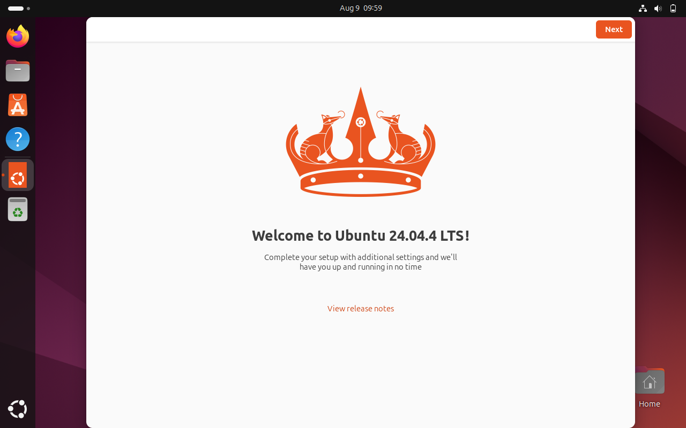
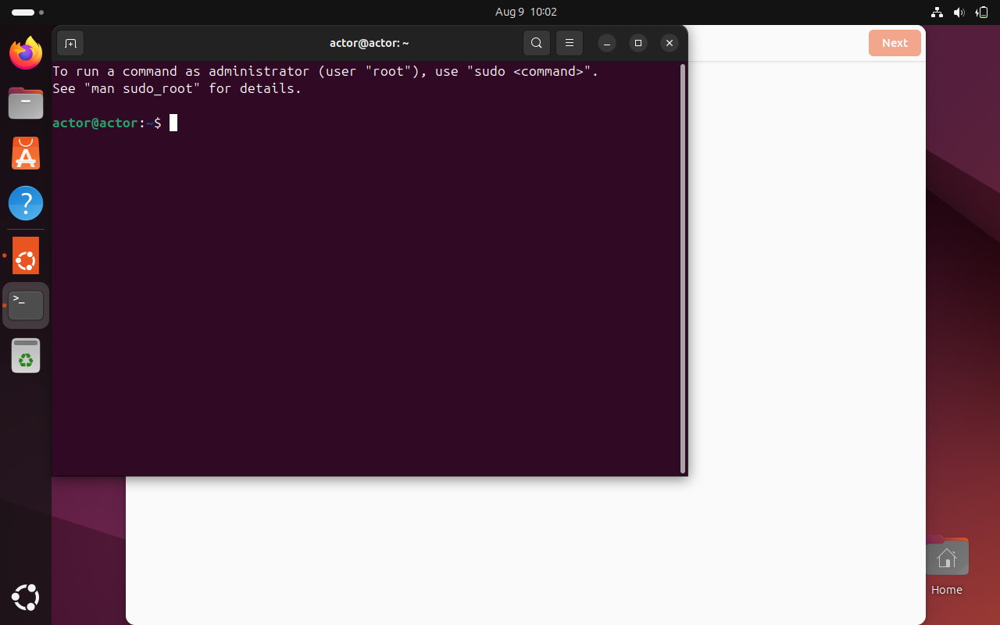
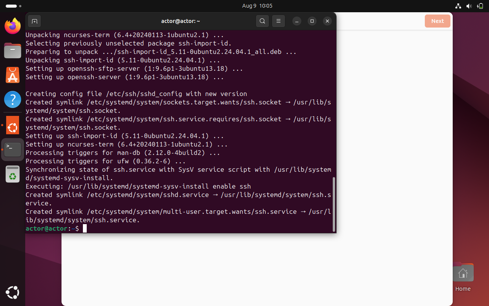
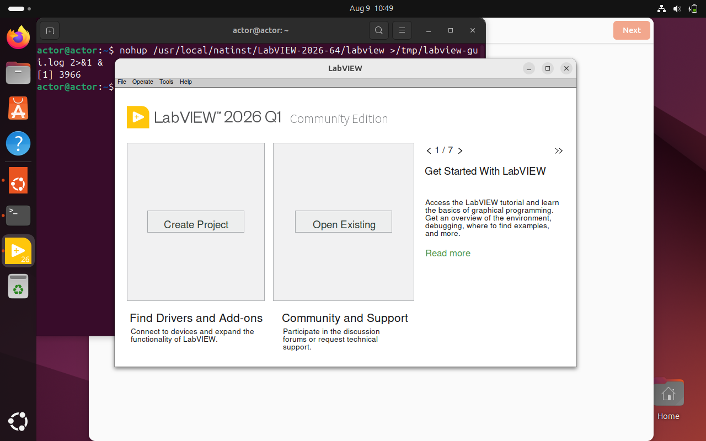
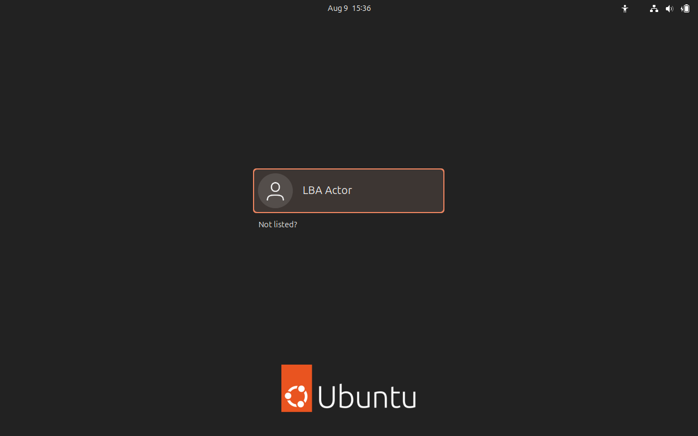

# Ubuntu 24.04 + LabVIEW 2026 Installation Reference

This is the canonical installation reference for the tested Ubuntu variant used by users, agents, and
operators of `labview-benchmark-actor`.

## Tested variant

| Item | Tested value |
| --- | --- |
| Guest OS | Ubuntu 24.04.4 LTS desktop, 64-bit |
| Hypervisor | Oracle VirtualBox 7.2.8 |
| VM allocation | 12,288MB RAM, 6 vCPUs |
| LabVIEW | 2026 Q1 Community Edition, 64-bit (`26.1.1.49170-0+f18`) |
| LabVIEWCLI | `26.1.0.49328-0+f176` |
| VIPM | `26.3.1-4017` |
| Automation display | active graphical seat; Xvfb remains a fallback |
| VI Server | TCP 3363 |

The measurements below are observations from one disposable linked clone. They are not performance guarantees
for other hosts.

## 1. Create a disposable VM

Keep the retained source VM powered off. Clone a proven snapshot rather than modifying the source.

The measured baseline:

- source VM: `lba-ubuntu2404-labview2026-scratch`;
- source UUID: `6680988b-5eb3-434d-96c6-8cf22f3055b9`;
- snapshot: `mass-compile-baseline-20260809-094107`;
- snapshot UUID: `73913831-d37c-48ca-81a9-d9cf585e9767`.

The snapshot booted to the graphical login screen:


First-clone timing was unusually slow:

| Milestone | Elapsed from VirtualBox running state |
| --- | ---: |
| Login screen captured | 15m 17.868s |
| Desktop / first-login wizard visible | 17m 17.085s |
| Terminal available | 19m 58.478s |
| OpenSSH installation complete | 22m 27.047s |
| SSH functional probe passed | 22m 57.767s |

The first-login wizard was the visible boundary between successful desktop login and terminal setup:



These timings include manual login, Ubuntu's first-login wizard, and installing OpenSSH. They are not warm-boot
metrics.

## 2. Establish remote automation during unattended installation

New cleanroom bases use VirtualBox 7.2.8's unattended post-install template before the first reboot. No graphical
login is required. Keep the disposable password in a mode-0600 file and select an operator-owned, collision-free
host-loopback port:

```bash
chmod 600 /safe/local/path/actor-password
ISO=/path/to/ubuntu-24.04.4-desktop-amd64.iso \
VM_NAME=lba-ubuntu2404-base-proof-YYYYMMDDTHHMMSSZ \
GUEST_PASSWORD_FILE=/safe/local/path/actor-password \
SSH_HOST_PORT=2222 \
cleanroom/ubuntu-labview/build-virtualbox.sh --run
```

The builder passes the maintained `base-bootstrap.sh` through `--post-install-template`. Before first login it:

- installs `openssh-server`, Git, and `virtualbox-guest-utils`;
- enables SSH and guest utilities;
- enables a first-boot validator;
- writes `/var/lib/lba-cleanroom/base-bootstrap-receipt.json`.

The receipt fails closed unless SSH, Git, and the supported VirtualBox guest service are present and active. It
contains OS/version, exact VM name/UUID, absolute tool paths and versions, service states, wall-clock and monotonic
timings, failures, and outcome, with no credential fields. The builder also fails before installation if its
bootstrap template is missing or the installed `VBoxManage` lacks the supported post-install hook.

SSH forwarding is never implicit:

- set `SSH_HOST_PORT` to create a `127.0.0.1`-only VirtualBox NAT forward to guest port 22;
- do not expose SSH to a LAN;
- never record the disposable password in logs, commands, screenshots, or receipts;
- confirm SSH with a concrete command such as `id -u`, `hostname`, and `systemctl is-active ssh`.

The screenshots `terminal-ready.png` and `ssh-install.png` document the historical manual bootstrap measured in
section 1. That path required a graphical login and is retained as baseline evidence, not as the maintained build
procedure:





## 3. Run the maintained provisioner

Upload these repository files to the clone:

```text
cleanroom/ubuntu-labview/provision-guest.sh
cleanroom/ubuntu-labview/ni-labview-2026-noble-community.asc
```

Run:

```bash
sudo env PRIMARY_USER=actor PROVISION_REBOOT=0 \
  bash /home/actor/lba-provision/provision-guest.sh
```

The measured provisioner run:

| Metric | Measured value |
| --- | ---: |
| Monotonic duration | 164.532s |
| Exit code | 0 |
| LabVIEW package | `ni-labview-2026-community 26.1.1.49170-0+f18` |
| LabVIEWCLI package | `ni-labview-command-line-interface 26.1.0.49328-0+f176` |
| VIPM package | `26.3.1-4017` |

The provisioner installs Xvfb and required libraries, configures VI Server TCP 3363 for both LabVIEW executable
basenames, installs VIPM, and deliberately stops before NI-account activation.

## 4. Reboot and verify prerequisites

A post-install reboot is required. Measure reboot completion by:

1. recording `/proc/sys/kernel/random/boot_id`;
2. requesting reboot;
3. reconnecting through SSH;
4. requiring a changed boot ID and `systemctl is-active ssh`.

Measured reboot request to verified SSH-ready:

```text
18.829s
```

The first connection failure occurred 0.110s after the request.


The later provisioner-required reboot reached the same credential-safe graphical login boundary:


Run the maintained readiness check:

```bash
bash cleanroom/ubuntu-labview/activation-ready.sh --check
```

All prerequisite checks must pass:

- LabVIEWCLI and LabVIEW binary;
- NI AddTwoNumbers probe VI;
- Python, Xvfb, and `xdpyinfo`;
- VIPM package and command;
- graphical target, display manager, and graphical console seat;
- `labview.conf` and `labviewcommunity.conf`;
- VI Server TCP 3363 and quoted wildcard access lists;
- passwordless sudo for the disposable `actor` account.

## 5. Complete human NI activation

Launch LabVIEW interactively:

```bash
/usr/local/natinst/LabVIEW-2026-64/labview
```

The human operator signs into their NI account. Agents must not request, type, store, screenshot, or transmit NI
credentials.

After activation, LabVIEW opens normally:



The observed interval between the activation-boundary screenshot and activated-window screenshot was at most
224.723s. This includes human interaction and is not an automated performance metric.

## 6. Prove activation functionally

A screenshot is not activation proof. Run the known-answer probe:

```bash
bash experiments/activation/probe-activation.sh 20 22 /tmp/lba-activation-capture.json
```

Expected:

- exit code 0;
- VI Server connection on port 3363;
- operation output 42;
- `RunVI operation succeeded`;
- a fresh 32-hex activation challenge;
- display mode recorded.

Measured activation probe:

| Metric | Measured value |
| --- | ---: |
| CLI wall time | 1,584ms |
| Expected/actual | 42 / 42 |
| Display mode | `active-graphical-seat` |

On this Ubuntu build, Xvfb execution segfaulted. The maintained probe therefore reuses a valid active graphical
LabVIEW seat first and retains Xvfb only as a fallback for previously validated hosts.

## 7. Example performance proof: Mass Compile

The measured workload used:

- repository `ni/labview-icon-editor`;
- commit `9545c483f2b947c71de68c7f70aedefaedadabf7`;
- directory `resource`;
- 307 VIs/CTLs;
- zero bad VIs.

Source preparation required Git 2.43.0:

| Phase | Duration |
| --- | ---: |
| Install Git | 6.906s |
| Clone and detach pinned source | 10.375s |

Run:

```bash
LabVIEWCLI \
  -LabVIEWPath /usr/local/natinst/LabVIEW-2026-64/labview \
  -PortNumber 3363 \
  -OperationName MassCompile \
  -DirectoryToCompile /home/actor/labview-icon-editor/resource \
  -MassCompileLogFile /home/actor/lba-provision/mass-compile.log \
  -AppendToMassCompileLog FALSE
```

Measured result:

| Metric | Measured value |
| --- | ---: |
| LabVIEW report interval | 60s |
| CLI wall time | 60.582s |
| Samples | 58 at 500ms |
| Average LabVIEW process CPU | 92.70% |
| Peak LabVIEW RSS | 397.55MB |
| Minimum available guest memory | 10,286.29MB |
| Disk read delta | 1,785,856 bytes |
| Disk write delta | 44,752,896 bytes |
| Maximum one-minute load | 1.20 |
| Result hash | `bf722123ba07ac4611e41eadf605cf45b20d398d3229b2b837d3f5115d0a7966` |

The result hash matches the existing host, golden-VM, and Windows measurements. Timing and resource usage are
substrate-specific and are intentionally excluded from that identity.

## Clock domains

Host screenshot timestamps and guest LabVIEW timestamps are separate clock domains. The first boot accumulated
VirtualBox timer catch-up stalls, so do not subtract host and guest wall clocks. Use monotonic durations measured
within one domain.

## Live evidence changelog requirement

Agents updating this reference must append an entry as each live phase completes or materially changes. On a
best-effort basis, pair every narrative with visual evidence captured near the event.

Each entry must include:

- UTC timestamp and monotonic elapsed time when available;
- VM name/UUID and phase;
- precise narrative of the visible transition;
- screenshot path and SHA-256;
- machine-readable log/receipt path and digest;
- measured timing/performance;
- outcome (`PASS`, `FAIL`, `BLOCKED`, or `IN_PROGRESS`);
- uncertainty, sampling interval, or reason a safe screenshot was unavailable.

For unattended-base runs, the entry must additionally state whether any graphical login occurred, the exact
VM-running-to-SSH-ready duration from the host monotonic clock, the bounded polling timeout/interval, the NAT
host-loopback port, the bootstrap receipt hash, and the cleanup result for only the disposable VM. If boot
screenshots are captured, list every retained screenshot path and SHA-256; if capture is unavailable, record the
failed best-effort attempt rather than inventing visual proof.

Visual evidence must not be used to claim hidden state such as activation, package integrity, or command success;
pair those claims with command output or receipts. Never capture credentials, account pages, tokens, computer IDs,
private keys, or other secrets.

### Live evidence entry: unattended base automation

At `2026-08-09T12:53:04.360Z`, VirtualBox entered the running state for disposable VM
`lba-ubuntu-base-proof-20260809T125300Z` (`2ed1afd2-a896-4dad-b045-f09dbc57074b`). SSH and the bootstrap receipt
passed at `2026-08-09T13:14:00.402254600Z`: **1,256.0422546s (20m 56.0422546s)** from running state, with
five-second bounded polling and no graphical login. The stock-ISO install completed, but NAT remained unavailable
after its first reboot; one controlled reset at `2026-08-09T13:13:42.7556767Z` recovered the known VirtualBox
cold-boot stall. The elapsed result includes that reset.

The SSH proof returned uid `1000`, hostname `actor`, Git `2.43.0`, active SSH, active VirtualBox guest utilities,
and a PASS bootstrap receipt. The receipt records OpenSSH server package `1:9.6p1-3ubuntu13.18`,
`VBoxService 7.0.16_Ubuntur162802`, enabled service states, and no failures. LabVIEW provisioning and activation
were not attempted.

Evidence was retained outside Git under
`C:\Users\sveld\.copilot\session-state\af313f92-0145-44da-8d0a-cac86b86eae7\files\lba-ubuntu-base-proof-20260809T125300Z`:

- `base-bootstrap-receipt.json` SHA-256 `9cae56975a2d54b794844042445a1c4208ff7213718ac6ea62cd09169a41881c`;
- `live-proof-receipt.json` SHA-256 `4a438d16d4c1d0a00fc64cb4394d3e301f097b376689a115ef2d61352a8985b9`;
- `controlled-reset.json` SHA-256 `79c592259b3e896048bc83f04504b2c21d3040b563438ff93ea5a49b0439bb47`;
- `ssh-proof.txt` SHA-256 `000170447c0581eec580761e1cc8f93e86bcb0eeabe734a9a3baad62dd0c0fc8`;
- 21 timestamped PNGs under `screenshots\`, indexed with individual SHA-256 values in the live receipt. The first
  image hash is `37c484cbfc93b8ba23d34b312e841d4003b4fd1aed9144d0c5b6cfe7c756f0d6`; the final pre-reset image hash is
  `3ea4975b2bed64e2e1b7e8b41e788a61c5ac3dba57e12544dafb1e7b7d384cbe`.

The sampling uncertainty is less than or equal to the five-second polling interval. Cleanup passed: only this
disposable VM was unregistered and its residual VM folder removed; the retained source VM was not mutated.

### Merged-head replay: 2026-08-09

A fresh stock-ISO replay started from `origin/develop`
`07f8e3329750393508bab47b85db774ec96f1a52`. The merged guest bootstrap was unchanged; replay setup found and
fixed one host-only interoperability defect where `grep -q` plus `pipefail` could make supported VirtualBox 7.2.8
appear to lack `--post-install-template` when its help producer received `SIGPIPE`.

Disposable VM `lba-ubuntu-base-replay-20260809T140500Z`
(`7ca81b5c-45a8-42a5-a6cc-a481b6331155`) entered running state at
`2026-08-09T13:54:15.868Z`. No graphical login occurred. The guest bootstrap receipt passed with:

- OpenSSH server `1:9.6p1-3ubuntu13.18`, active and enabled;
- Git `2.43.0`;
- `VBoxService 7.0.16_Ubuntur162802`, active and enabled;
- monotonic install duration `10.926017658s`;
- monotonic first-boot validation duration `0.300449402s`.

The first boot again accumulated a VirtualBox timer/NAT stall. A controlled reset at
`2026-08-09T14:16:05.2758831Z` did not restore progress; one controlled power cycle at
`2026-08-09T14:18:07.2787897Z` did. The bootstrap receipt completed at
`2026-08-09T14:18:54.921224159Z`. Host-loopback SSH proof was observed at
`2026-08-09T14:22:15.1713096Z`, **1,679.3033096s (27m 59.3033096s)** after the original running state. This is a
conservative observed upper bound. The NAT rule mapped Windows `127.0.0.1:22523` to guest port `22`. This replay
did not use one fixed-interval readiness loop with an overall timeout: operator probes followed bounded waits of
300, 600, 120, 90, 90, 5, and 120 seconds, and the final host SSH invocation used a five-second connection timeout.
Early WSL probes targeted WSL's own loopback and could not reach the Windows-loopback-only NAT rule; final proof
used host Git SSH without broadening the `127.0.0.1` bind. Therefore no single polling interval defines sampling
uncertainty for this replay; the earlier first proof remains the canonical five-second bounded-poll measurement.

The SSH proof returned uid `1000`, hostname `actor`, Git, active SSH, active guest utilities, and the PASS receipt.
LabVIEW provisioning and activation were not attempted. Evidence is outside Git under
`C:\Users\sveld\.copilot\session-state\af313f92-0145-44da-8d0a-cac86b86eae7\files\lba-ubuntu-base-replay-20260809T140500Z`:

- `replay-receipt.json` SHA-256 `45ae1535e0913a1db611e19b1d31228e9ed624f967004d203d24b7dada3ec7d7`;
- `base-bootstrap-receipt.json` SHA-256 `e0290c9f119eb156d78012ee0965a70258078eb40aa8d13b33f8c91778365257`;
- `ssh-proof-host.txt` SHA-256 `0f10bbe53cd8642820473cb199882712a3f9395d964143cf0438536c2d065d08`;
- `controlled-reset.json` SHA-256 `01ee9e352a72c75c635ca35918176eafb24982b8d1ae447da69113e485bbcc5d`;
- `controlled-power-cycle.json` SHA-256
  `592eff863673a1dc167fb775674cebdc8cb09b14d742c36a163542ca22430c43`;
- 28 timestamped PNGs indexed in the replay receipt; first hash
  `970f44a78b3a39cae5b61c271b8d66a8938d87ecd67a8d566fae42db9b591c35`, final hash
  `aaa4748c28864d12df45b9088fd7f5efb52aa61bd23d454054a450debc87393c`.

Cleanup passed: only the disposable replay VM was unregistered, its residual folder and credentials were removed,
and the retained source VM remained registered and untouched.

### Production golden-base proof: 2026-08-09

The governed production definition was proven from the stock Ubuntu ISO at source commit
`dd942e162c2ea688bc1e0916a84b52cad0bab908`. Disposable VM
`lba-ubuntu-golden-proof-20260809T152012Z`
(`4751fa12-8f30-4ba2-8642-1920b5315bda`) used Windows-loopback NAT
`127.0.0.1:50533` to guest port 22. No graphical login, LabVIEW provisioning, activation, or Vagrant box publication
occurred.

The orchestrator observed the VM running and SSH readiness on one `System.Diagnostics.Stopwatch` clock:

| Proof metric | Measured value |
| --- | ---: |
| VM-running to SSH-ready | 952.458405s (15m 52.458405s) |
| Poll interval / bound | 5s / 2,700s |
| SSH connect timeout | 5s |
| Probe attempts | 180 |
| Bootstrap package install | 11.933531027s monotonic |
| First-boot receipt validation | 0.210814198s monotonic |
| Controlled recovery actions | 0 |

The SSH proof returned uid `1000`, hostname `actor`, Git `2.43.0`, active/enabled SSH, active/enabled
`VBoxService 7.0.16_Ubuntur162802`, and the PASS receipt. The final credential-safe screenshot shows the graphical
login boundary reached without logging in:



The line-ending-neutral normalized proof digest is
`2f4fadeb8e5b7857e24386cd5b824830692429cf17ce00c6365031b3d69b66f2`. Raw evidence remains outside Git under
`E:\lba-session-evidence\b31cca8a-ef61-4e1c-bd75-f5d5b4c4850a\lba-ubuntu-golden-proof-20260809T152012Z`:

- `live-run.json` SHA-256 `4aefe67e5fae55234a2c7fb6fc9450407ca18b740b9d22da57a668973f641c7d`;
- `base-bootstrap-receipt.json` SHA-256
  `c4df3ccc1b2cc16265c3a4f262598108d8bd3d2fd639ccf68f8dfbd7ba5f34bc`;
- `ssh-proof.txt` SHA-256 `1a9cfd984a038c41dd3e99788d45428a2f13fd113e240fd5886dd2193250cd42`;
- 17 timestamped guest-console PNGs; the published final image SHA-256 is
  `2325b8a4d71b54de9ba94d171932a4da7b26517c1446cae3453ab695a7cbeb7e`.

Cleanup passed: the disposable VM was unregistered, its `E:\VirtualBox VMs` directory was removed, and its
credential file was destroyed. A preceding attempt was invalidated without a readiness claim after an unrelated
host capture exhausted `C:`; the successful run isolated its VM and evidence on `E:` with more than 180GB free.

### Draft screenshot disposition

The historical draft named more captures than this public reference uses. The credential-safe, claim-relevant
first-login and post-reboot images are now included above. The password-entry image, machine-specific activation
boundary, blank provisioner capture, repeated splash frames, duplicate activated-window frame, and locked-screen
Mass Compile sampler remain evidence-only because they are unsafe, duplicative, blank, or do not visibly support
their associated machine claim.

## Cleanup

After evidence extraction:

- power off and delete only the disposable clone;
- verify the retained source VM is powered off;
- preserve or delete the source snapshot according to the operator's explicit decision;
- retain raw logs/screenshots outside Git;
- commit only normalized, non-secret receipts and safe documentation images.
